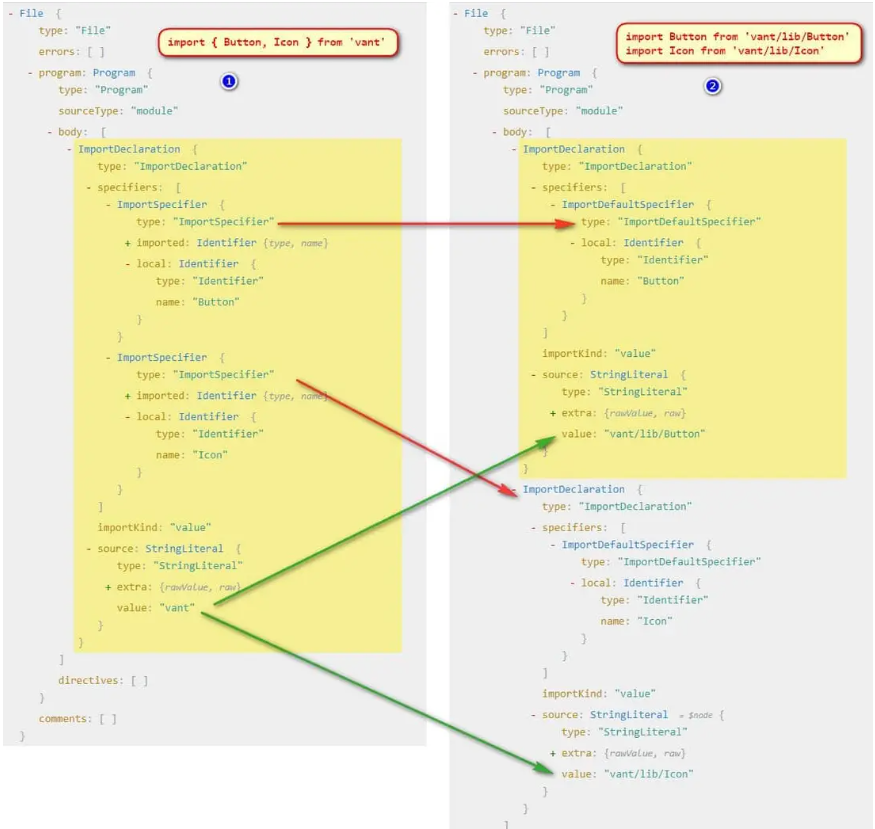

[ast文章](https://segmentfault.com/a/1190000023389980)

# AST
### 词法分析

```
var a = 2 ，这段代码通常会被分解成 var、a、=、2

[
  { type: 'Keyword', value: 'var' },
  { type: 'Identifier', value: 'a' },
  { type: 'Punctuator', value: '=' },
  { type: 'Numeric', value: '2' },
];
```

### 语法分析
也称解析器
```
{
  ...
  "type": "VariableDeclarator",
  "id": {
    "type": "Identifier",
    "name": "a"
  },
  ...
}
```

### AST解析流程

```
比如说一段代码 function getUser() {}，
我们把函数名字更改为 hello，看代码流程


const esprima = require('esprima');
const estraverse = require('estraverse');
const code = `function getUser() {}`;

// 生成 AST
const ast = esprima.parseScript(code);
// 转换 AST，只会遍历 type 属性
// traverse 方法中有进入和离开两个钩子函数
// 转换树
estraverse.traverse(ast, {
  // 进入离开修改都是可以的
  enter(node) {
    console.log('enter -> node.type', node.type);
    if (node.type === 'Identifier') {
      node.name = 'hello';
    }
  },
  leave(node) {
    console.log('leave -> node.type', node.type);
  },
});
// 生成新的代码
const result = escodegen.generate(ast);
console.log(result);
// function hello() {}

```


### 能做什么?

- 语法检查、代码风格检查、格式化代码、语法高亮、错误提示、自动补全等
- 代码混淆压缩
- 优化变更代码，改变代码结构等


# Babel

## babel工作原理

需要用到两个工具包 @babel/core、@babel/preset-env
当配置了 presets 中有 @babel/preset-env，那么 @babel/core 就会去找 preset-env 预设的插件包，它是一套
核心包只提供一些核心 API，真正的代码转换工作由插件或者预设来完成，比如要转换箭头函数，
会用到这个 plugin，@babel/plugin-transform-arrow-functions

```javascript
const babel = require('@babel/core');
const code = `const fn = (a, b) => a + b`;
// babel 有 transform 方法会帮我们自动遍历，使用相应的预设或者插件转换相应的代码
const r = babel.transform(code, {
  presets: ['@babel/preset-env'],
});
console.log(r.code);
// 打印结果如下
// "use strict";
// var fn = function fn() { return a + b; };
```

```javascript

// 其实是可以在 node_modules 下面找到有个叫做 
// plugin-transform-arrow-functions 的插件，
// 这个插件是专门用来处理 箭头函数的，我们就可以这么写：

const r = babel.transform(code, {
  plugins: ['@babel/plugin-transform-arrow-functions'],
});
console.log(r.code);
// 打印结果如下
// const fn = function () { return a + b; };
```


根据分析可得：

- 变成普通函数之后他就不叫箭头函数了 ArrowFunctionExpression，而是函数表达式了 FunctionExpression
- 首先要把 箭头函数表达式(ArrowFunctionExpression) 转换为 函数表达式(FunctionExpression)
- 要把 二进制表达式(BinaryExpression) 包裹在 返回语句中(ReturnStatement) 然后 push 到 代码块中(BlockStatement)，
- 其实要做就是把一棵树变成另外一颗树，说白了其实就是拼成另一颗树的结构，然后生成新的代码，就可以完成代码的转换

### 访问者模式
```javascript
// 比如说上面的当我们访问到 ArrowFunctionExpression 的时候，对 ArrowFunctionExpression 进行修改，变成普通函数
const babel = require('@babel/core');
const code = `const fn = (a, b) => a + b`; // 转换后 const fn = function(a, b) { return a + b }
const arrowFnPlugin = {
  // 访问者模式
  visitor: {
    // 当访问到某个路径的时候进行匹配
    ArrowFunctionExpression(path) {
      // 拿到节点
      const node = path.node;
      console.log('ArrowFunctionExpression -> node', node);
    },
  },
};

const r = babel.transform(code, {
  plugins: [arrowFnPlugin],
});

console.log(r);
```


babel 为我们提供了一个工具叫做 @babel/types

@babel/types 有两个作用：

- 判断这个节点是不是这个节点（ArrowFunctionExpression 下面的 path.node 是不是一个 ArrowFunctionExpression）
- 生成对应的表达式


t.functionExpression(id, params, body, generator, async);
- id: Identifier (default: null) id 可传递 null
- params: Array<LVal> (required) 函数参数，可以把之前的参数拿过来
- body: BlockStatement (required) 函数体，接受一个 BlockStatement 我们需要生成一个
- generator: boolean (default: false) 是否为 generator 函数，当然不是了
- async: boolean (default: false) 是否为 async 函数，肯定不是了

```javascript

// 还需要生成一个 BlockStatement，我们接着看文档找到 BlockStatement 接受的参数

t.blockStatement(body, directives);
// 看文档说明，blockStatement 接受一个 body，那我们把之前的 body 拿过来就可以直接用，不过这里 body 接受一个数组


function ArrowFunctionExpression(path) {
  // 拿到节点然后替换节点
  const node = path.node;
  // 拿到函数的参数
  const params = node.params;
  const returnStatement = t.returnStatement(node.body);
  const blockStatement = t.blockStatement([returnStatement]);
  
	// 如果没有返回语句

	// 把 returnStatement 换成 expressionStatement 即可
	const expressionStatement = t.expressionStatement(node.body);
	const blockStatements = t.blockStatement([expressionStatement]);
	
  const functionExpression = t.functionExpression(null, params, blockStatement);
  // 替换原来的函数
  path.replaceWith(functionExpression);
}
// 结果 const fn = function (a, b) { return a + b; };
```


### 按需引入

```javascript
// import { Button, Icon } from 'vant' 
// 写法转换为 
// import Button from 'vant/lib/Button'; 
// import Icon from 'vant/lib/Icon'
```

根据两张图分析我们可以得到一些信息：

- 解构方式引入的模块只有 import 声明，第二张图是两个 import 声明
- 解构方式引入的详细说明里面(specifiers)是两个 ImportSpecifier，第二张图里面是分开的，而且都是 ImportDefaultSpecifier
- 他们引入的 source 也不一样
- 要做的其实就是要把单个的 ImportDeclaration 变成多个 ImportDeclaration, 然后把单个 import 解构引入的 specifiers 部分 ImportSpecifier 转换成多个 ImportDefaultSpecifier 并修改对应的 source 即可

```javascript
const babel = require('@babel/core');
const t = require('@babel/types');
const code = `import { Button, Icon } from 'vant'`;
// import Button from 'vant/lib/Button'
// import Icon from 'vant/lib/Icon'
function importPlugin(opt) {
  const { libraryDir } = opt;
  return {
    visitor: {
      ImportDeclaration(path) {
        const node = path.node;
        // console.log("ImportDeclaration -> node", node)
        // 得到节点的详细说明，然后转换成多个的 import 声明
        const specifiers = node.specifiers;
        // 要处理这个我们做一些判断，首先判断不是默认导出我们才处理，要考虑 import vant, { Button, Icon } from 'vant' 写法
        // 还要考虑 specifiers 的长度，如果长度不是 1 并且不是默认导出我们才需要转换
        if (!(specifiers.length === 1 && t.isImportDefaultSpecifier(specifiers[0]))) {
          const result = specifiers.map(specifier => {
            const local = specifier.local;
            const source = t.stringLiteral(
              `${node.source.value}/${libraryDir}/${specifier.local.name}`
            );
            // console.log("ImportDeclaration -> specifier", specifier)
            return t.importDeclaration([t.importDefaultSpecifier(local)], source);
          });
          console.log('ImportDeclaration -> result', result);
          // 因为这次要替换的 AST 不是一个，而是多个的，所以需要 `path.replaceWithMultiple(result)` 来替换，但是一执行发现死循环了
          path.replaceWithMultiple(result);
        }
      },
    },
  };
}
const r = babel.transform(code, {
  plugins: [importPlugin({ libraryDir: 'lib' })],
});
console.log(r.code);
```


如果是 import vant, { Button, Icon } from 'vant'

```javascript
// 所以还需要判断一下，每一个 specifier 是不是一个 ImportDefaultSpecifier 
// 然后处理不同的 source，完整处理逻辑应该如下

function importPlugin(opt) {
  const { libraryDir } = opt;
  return {
    visitor: {
      ImportDeclaration(path) {
        const node = path.node;
        // console.log("ImportDeclaration -> node", node)
        // 得到节点的详细说明，然后转换成多个的 import 声明
        const specifiers = node.specifiers;
        // 要处理这个我们做一些判断，首先判断不是默认导出我们才处理，要考虑 import vant, { Button, Icon } from 'vant' 写法
        // 还要考虑 specifiers 的长度，如果长度不是 1 并且不是默认导出我们才需要转换
        if (!(specifiers.length === 1 && t.isImportDefaultSpecifier(specifiers[0]))) {
          const result = specifiers.map(specifier => {
            let local = specifier.local,
              source;
            // 判断是否存在默认导出的情况
            if (t.isImportDefaultSpecifier(specifier)) {
              source = t.stringLiteral(node.source.value);
            } else {
              source = t.stringLiteral(
                `${node.source.value}/${libraryDir}/${specifier.local.name}`
              );
            }
            return t.importDeclaration([t.importDefaultSpecifier(local)], source);
          });
          path.replaceWithMultiple(result);
        }
      },
    },
  };
}
```


### 使用babylon

```javascript
// const arr = [ ...arr1, ...arr2 ] 
// 转成 
// var arr = [].concat(arr1, arr2)
```


```javascript
const babylon = require('babylon');
// 使用 babel 提供的包，traverse 和 generator 都是被暴露在 default 对象上的
const traverse = require('@babel/traverse').default;
const generator = require('@babel/generator').default;
const t = require('@babel/types');

const code = `const arr = [ ...arr1, ...arr2 ]`; // var arr = [].concat(arr1, arr2)

const ast = babylon.parse(code, {
  sourceType: 'module',
});

// 转换树
traverse(ast, {
  VariableDeclaration(path) {
    const node = path.node;
    const declarations = node.declarations;
    console.log('VariableDeclarator -> declarations', declarations);
    const kind = 'var';
    // 边界判定
    if (
      node.kind !== kind &&
      declarations.length === 1 &&
      t.isArrayExpression(declarations[0].init)
    ) {
      // 取得之前的 elements
      const args = declarations[0].init.elements.map(item => item.argument);
      const callee = t.memberExpression(t.arrayExpression(), t.identifier('concat'), false);
      const init = t.callExpression(callee, args);
      const declaration = t.variableDeclarator(declarations[0].id, init);
      const variableDeclaration = t.variableDeclaration(kind, [declaration]);
      path.replaceWith(variableDeclaration);
    }
  },
});
```


### 优雅处理async await

```javascript

// 转换前
async function func() {
	await asyncFn();
}

// 为了程序的健壮性，就可能需要在 async 中频繁的书写 try/catch 逻辑，
// 此时我们可以就可以使用 ast 捕获到相应的代码然后处理没有被 
// try/catch 的 await 语句

function AwaitExpression(path) {
	// 可以利用 path 参数的 findParent 方法向上遍历所有父节点，判断是否被 try/catch 的 Node 包裹
	// 首先保证 await 语句没有被 try/catch 包裹
	if (path.findParent(path => t.isTryStatement(path.node))) {
		return;
	}
	const expression = t.expressionStatement(path.node);
	const tryBlock = t.blockStatement([expression]);
	// 生成 catch --> console.log(e)
	const paramsE = t.identifier('e');
	const memberExpression = t.MemberExpression(t.identifier('console'), t.identifier('log'));
	const consoleExpression = t.expressionStatement(t.callExpression(memberExpression, [paramsE]));
	const catchClause = t.catchClause(paramsE, t.blockStatement([consoleExpression]));
	const tryStatement = t.tryStatement(tryBlock, catchClause);
	// 数组
	path.replaceWithMultiple([tryStatement]);
}
// 得到的结果：
// async function func() {
//   try {
//     await asyncFn();
//   } catch (e) {
//     console.log(e);
//   }
// }
```


特殊情况

```javascript
async function func() {
  const r = await asyncFn1();
  res = await asyncFn2();
  await asyncFn3();
}


 function AwaitExpression(path) {
	// 首先保证 await 语句没有被 try/catch 包裹
	if (path.findParent(path => t.isTryStatement(path.node))) return;
	const parent = path.parent;
	let replacePath = null;
	if (t.isVariableDeclarator(parent) || t.isAssignmentExpression(parent)) {
		// 赋值和声明的方式结构类似，都是在 AwaitExpression 中 path 的 parentPath.parentPath 上的节点就是 blockStatement 所需要的的参数，可以直接这么替换
		replacePath = path.parentPath.parentPath;
	} else {
		// 如果只是表达式的话，path.parentPath.node 就是 blockStatement 参数
		replacePath = path.parentPath;
	}
	const tryBlock = t.blockStatement([replacePath.node]);
	// 生成 catch --> new Error(e)
	const paramsE = t.identifier('e');
	const throwStatement = t.throwStatement(t.newExpression(t.identifier('Error'), [paramsE]));
	const catchClause = t.catchClause(paramsE, t.blockStatement([throwStatement]));
	const tryStatement = t.tryStatement(tryBlock, catchClause);
	replacePath.replaceWithMultiple([tryStatement]);
}
// 得到结果
// async function func() {
//   try {
//     const r = await asyncFn1();
//   } catch (e) {
//     throw new Error(e);
//   }

//   try {
//     res = await asyncFn2();
//   } catch (e) {
//     throw new Error(e);
//   }

//   try {
//     await asyncFn3();
//   } catch (e) {
//     throw new Error(e);
//   }
// }
```

[语法树类型](https://github.com/babel/babylon/blob/master/ast/spec.md)
(parameter) node: Identifier | SimpleLiteral | RegExpLiteral | Program | FunctionDeclaration | FunctionExpression | ArrowFunctionExpression | SwitchCase | CatchClause | VariableDeclarator | ExpressionStatement | BlockStatement | EmptyStatement | DebuggerStatement | WithStatement | ReturnStatement | LabeledStatement | BreakStatement | ContinueStatement | IfStatement | SwitchStatement | ThrowStatement | TryStatement | WhileStatement | DoWhileStatement | ForStatement | ForInStatement | ForOfStatement | VariableDeclaration | ClassDeclaration | ThisExpression | ArrayExpression | ObjectExpression | YieldExpression | UnaryExpression | UpdateExpression | BinaryExpression | AssignmentExpression | LogicalExpression | MemberExpression | ConditionalExpression | SimpleCallExpression | NewExpression | SequenceExpression | TemplateLiteral | TaggedTemplateExpression | ClassExpression | MetaProperty | AwaitExpression | Property | AssignmentProperty | Super | TemplateElement | SpreadElement | ObjectPattern | ArrayPattern | RestElement | AssignmentPattern | ClassBody | MethodDefinition | ImportDeclaration | ExportNamedDeclaration | ExportDefaultDeclaration | ExportAllDeclaration | ImportSpecifier | ImportDefaultSpecifier | ImportNamespaceSpecifier | ExportSpecifier
