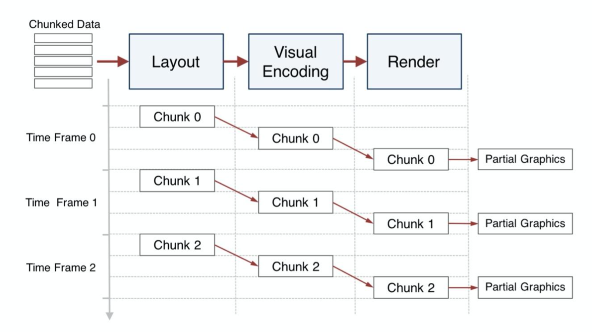

### ECharts中实现图表的动态加载和更新
setOption
```javascript
// 基于准备好的dom，初始化echarts实例
var myChart = echarts.init(document.getElementById('main'));

// 设置初始图表
myChart.setOption({
    title: { text: 'ECharts 示例' },
    tooltip: {},
    xAxis: { data: ["一月", "二月", "三月", "四月", "五月", "六月"] }, 
    yAxis: {},
    series: [{ name: '销量', type: 'bar', data: [5, 20, 36, 10, 10, 20] }]
});

// 在获取新数据后，通过setOption更新数据，比如：
myChart.setOption({
    series: [{ data: [10, 22, 30, 23, 17, 33] }]  // 新的数据
});

```

### ECharts的延迟加载
在ECharts的配置项中，设置dataZoom组件的start和end属性，这两个属性控制了初始状态下图表显示数据的范围。
例如，可以设置start: 0, end: 10，则一开始只显示数据的前10%。
```javascript
var myChart = echarts.init(document.getElementById('main'));
myChart.setOption({
    dataZoom: [
        {
            type: 'slider',
            start: 0,
            end: 10
        }
    ],
});

// dataZoom范围改变事件
myChart.on('datazoom', function (params) {
	// 获取新的start和end值
	var start = params.start;
	var end = params.end;
	// 加载新的数据
	var newData = getData(start, end);
	// 更新图表
	myChart.setOption({
		series: [{
			data: newData
		}]
	});
});

```


### 创建特殊图表
自定义系列主要通过 renderItem 函数来定义图形的绘制逻辑
```javascript
   var option = {
     xAxis: {
       type: 'value'
     },
     yAxis: {
       type: 'value'
     },
     series: [{
       type: 'custom',
       renderItem: function (params, api) {
         var xValue = api.value(0);
         var yValue = api.value(1);
         var coord = api.coord([xValue, yValue]);
         var size = api.size([1, 1]);

         return {
           type: 'rect',
           shape: {
             x: coord[0] - size[0] / 2,
             y: coord[1] - size[1] / 2,
             width: size[0],
             height: size[1]
           },
           style: api.style()
         };
       },
       data: [
         [10, 10],
         [20, 20],
         [30, 30]
       ]
     }]
   };
myChart.setOption(option);

```


### 全局配置字体、颜色、间距
```javascript
var option = {
    textStyle: {
        fontFamily: 'Arial',
        fontSize: 13,
    },
    color: ['#3398DB', '#7B8DE8', '#F49080', '#F7C244', '#57C17B'],
    grid: {
      left: 20,
      right: 20,
      top: 20,
      bottom: 20,
      containLabel: true  // 是否包含坐标轴的标签
    },
};
myChart.setOption(option);

```


### 事件机制
ECharts支持多种事件，包括但不限于:

click: 鼠标左键点击图表时触发
dblclick: 双击图表时触发
mouseover: 鼠标移到图表上时触发
mouseout: 鼠标从图表移开时触发
legendselectchanged: 图例选择状态发生改变时触发

绑定事件
```javascript
myChart.on('click', function (params) {
  console.log(params);
});

myChart.off('click');
```

### ECharts创建一个堆叠面积图(stack area chart)

- 数据准备：确保你的数据已经准备好并且符合堆叠面积图的显示和解析要求。数据通常需要按照时间序列或其他递进关系排列，并且每个数据点需要包含所有堆叠类别的值。
- 选择堆叠模式：在ECharts的series中，stack属性决定了是否进行堆叠，你需要设置这个属性以创建堆叠面积图。
- 面积部分透明度设置：一般来说，因为面积图是有一个覆盖效果的，所以为了让图形清晰，我们一般会将areaStyle的opacity属性设置为一个小于1的值。
- 调整图例和颜色：使用ECharts的legend和color属性可以指定堆叠面积图的图例和颜色，这能帮助用户更好的理解图表。
- 设置Y轴的最小值：为了更好地显示堆叠效果，可以设置Y轴的最小值为0。
- 交互与动态更新：ECharts提供的toolbox和dataZoom等选项可以增加图表的交互性。你也可以使用setOption方法动态更新图表。
- 考虑响应式布局：根据显示设备的大小和分辨率调整图表的大小和布局。


### 实现自定义tooltip

tooltip 组件提供了很多可配置的属性，例如：

- trigger：设置提示框触发的条件，可以设置为 'item' 或 'axis'，分别对应的是触发提示框的元素是单个数据项和坐标轴上的所有数据项。
- formatter：设置提示框显示内容的格式化模版。你可以定义一个函数，这个函数接收参数，然后返回你想要显示的内容。这个属性是最主要的属性，用来自定义 tooltip 的展示内容。


```javascript
var myChart = echarts.init(document.getElementById('main'));

var option = {
    title: {
        text: 'ECharts Tooltip 示例'
    },
    tooltip: { 
        trigger: 'item', 
        formatter: function(params) {
            return '我的自定义tooltip<br/>'
                 + params.seriesName + ' : <br/>'
                 + params.name + ' : '
                 + params.value;
        }
    },
    series : [
        {
            name:'销量',
            type:'bar',
            data:[10, 52, 200, 334, 390, 330, 220]
        }
    ]
};

myChart.setOption(option);

```


### 实现多Y轴
你需要在 yAxis 配置项中定义多个 Y 轴。然后，在系列（series）配置项中，
对每一个系列设置 yAxisIndex，该值对应着 yAxis 配置项数组的索引，
从而决定了此系列使用哪一个 Y 轴
```javascript
var myChart = echarts.init(document.getElementById('main'));

var option = {
    title: {
        text: 'ECharts 多 Y 轴示例'
    },
    tooltip: {
        trigger: 'axis'
    },
    legend: {
        data:['系列1','系列2']
    },
    yAxis: [
        {
            type: 'value',
            name: 'Y轴1',
        },
        {
            type: 'value',
            name: 'Y轴2',
        }
    ],
    series: [
        {
            name:'系列1',
            type:'line',
            data: [120, 200, 150, 80, 70, 110, 130],
            yAxisIndex: 0, // 这个系列使用第一个 Y 轴（索引为0）
        },
        {
            name:'系列2',
            type:'line',
            data: [22, 18, 491, 234, 290, 330, 310],
            yAxisIndex: 1, // 这个系列使用第二个 Y 轴（索引为1）
        }
    ]
};

myChart.setOption(option);

```


### ECharts 渲染大数据量的图表,性能问题

慢：加载缓慢、界面卡顿

难看：图表数据量过大、展示效果不好


措施：

- 数据降维与简化：减少图表需要渲染的数据量。这可以通过一些预处理的方式，比如数据降维，数据简化，数据抽样等方式实现。
- 开启 ECharts 的大数据模式：如果数据量较大，可以使用 ECharts 的 'large' 模式。当 series.large 设置为 true 时，ECharts 会自动对数据降采样，并采用 canvas 绘制而不是 svg，这样可以大大提高大数据量图表的渲染性能。
- 异步加载和更新数据：可以将大数据分批处理，通过异步方式逐步加载和更新数据。
- 关闭无用的动画和特效：动画和一些视觉特效可能会占用大量的计算资源，关闭它们可以提高性能。


### 图表图片导出
ECharts 提供了 getDataURL 和 getConnectedDataURL 方法，可以获取当前图表实例的截图。

```javascript
btn.addEventListener('click', function (){
    var url = chartInstance.getDataURL({
        // 导出的格式，可以是 'jpeg' 或者 'png'
        type: 'png',
        // 导出的图片背景色，默认使用 option 里的 backgroundColor
        backgroundColor: '#fff',
        // 导出的图片的长宽尺寸，默认使用原图尺寸
        pixelRatio: 2,
        // 是否不包含 toolbox。设置为 true 则 toolbox 的 icon 等相关元素不会画到图片里
        excludeComponents: ['toolbox']
    });
    // 下载图片
    downloadUrl(url);
});

function downloadUrl(url) {
    var a = document.createElement('a');
    a.href = url;
    a.download = 'echarts.png';
    a.click();
}

```

[文档](https://zhuanlan.zhihu.com/p/347325932)

## 架构
- 基于数据流的架构
- 
- 渐进式的可视化
- 
- 多线程渲染
- 
- 

借助web worker

为了可以让Echarts运行在计算线程中，计算线程里会生成一个虚拟的canvas，
虚拟canvas会记录所有计算任务最重触发的操作， 如改变填充样式，绘制文本等。
这些操作会被记录在一个Float32Array 命令数组中。
当一个计算任务完成，这个指令数组会被通过postMessage传送到UI主线程。
主线程中的canvas只需将最重需要执行的指令数组依次执行即可

## Zrender
Zrender是Echarts底层依赖的2D向量绘制库。

- 图形元素管理：Zrender会将一个个绘制过的图形，作为独立的对象维护管理起来。这些图形对象被存储在一颗树结构中，像DOM树一样。
- 叶子节点被称为displayable，包含最基本的元素，如文本、图片、路径。
- Path会对应一个Float32Array的数组，存储Path的相关信息，在重绘等情况下使用
- 非叶子节点被称为group，group是很多基本元素的集合
- 渲染管理：Zrender会管理不同元素的绘制顺序。
- 事件系统：Canvas上绘制的图形不能够相应任何鼠标事件，可以理解为绘制过程只是在画布上的像素进行着色。为了解决这个问题，Zrender提供了事件系统，使得绘制的图形可以独立响应特定的事件。对于每一个图形，Zrende会检测一个事件的位置坐标(x, y)是否在图形的包络盒中，如果在，则会将该元素传递给事件的回调，让事件知道被触发的图形元素。同时zrender还会提供事件冒泡能力。
- Zrender的事件系统是基于纯粹的JS实现的，不与具体的渲染引擎耦合，所以其可以轻松的和Canvas、SVG，VML等渲染引擎搭配使用。
