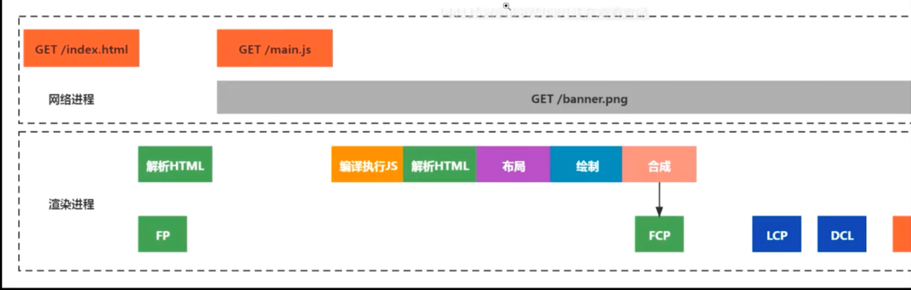

### 性能
- **FCP** (First Contentful paint)
  度量用户导航到页面后浏览器呈现第一块dom内容所花费的时间
  内容可以是文本 图片 非白色的canvas和svg 加载中的字体等, 不包括iframe
  0-2s 2-4s >4s
- SI (Speed Index)
  界面可见内容的显示速度
- **LCP** (Largest Contentful Paint)
  页面渲染出最大文本或图片的时间
  0-2.5s 2.5-4s >4s
- TTI (Time to Interactive)
  页面需要完整交互功能的时间
  0-3.8s 3.8s-7.3s >7.3s
- TBT
  阻止用户指令响应时间. 通过TCP和可交互时间之前长任务阻塞部分来计算, 50ms算长任务
  0-300ms 300ms-600ms >600ms
- **CLS** (Cumulative Layout Shift)
  整个页面生命周期内发生的单词布局偏移分数的总和
  0-0.1ms 0.1ms-0.25ms >0.25ms

- FID(First Input Delay)
  首次输入延迟,用户第一次预页面交互到浏览器实际能够响应该交互的时间
  0-100ms 100-300ms >300ms


### 无障碍/可访问性  (Accessibility)
```html
<!--alt 属性得加-->

```

### 最佳做法  (Best Practices)

### SEO
```html
<meta name="Description" content="我的生活" >
```

### 渐进式Web应用PWA (Progressive Web App)


### 通过命令
```
npm install -g lighthouse
lighthouse http://localhost:8080/index.html --local zh --quiet --chrome-flags="--headless" --only-categories=performance
```

https://www.webpagetest.org




- FP (First Paint) 
  浏览器从开始请求网站到屏幕渲染第一个像素点的时间


## 优化

### 改进FP和FCP
- 加快服务器响应速度
  - 升级服务器配置
  - 合理设置缓存
  - 优化数据库索引
- 加大服务器带宽
- 服务器开启gzip压缩
- 开启服务器缓存(redis)
- 避免重定向
- 使用dns-prefetch, 进行dns预解析
  - <link rel="dns-prefetch" href="" />
- 域名分片技术,突破同域6个TCP链接限制或者采用http2
- 使用cdn
- 压缩css js 图片等资源
  - TserserWebpackPlugin
  - purgecss-webpack-plugin
- 减少http请求, 合并jscss 合理内嵌js和css

### SI
- 最小化主线程工作
- 脚本
  - 优化第三方js脚本
  - 对输入进行防抖处理
  - 使用web workers
- 样式和布局
  - 缩小样式计算的范围并降低复杂性
  - 避免复杂布局和布局抖动
- 渲染
  - 坚持仅合成器的属性和管理层计数
  - 简化绘制的复杂度 减小绘制区域
- 解析HTML和css
  - 提取关键css
  - 压缩css
  - 延迟加载非关键的css
- 脚本解析和编译
  - 通过代码拆分减少js负载
  - 删除未使用的js
- 垃圾收集
  - 监控网页总内存使用情况

确保文本在webfont加载期间保持可见

```css
@font-face {
    font-family: "Al Bayan";
    font-style: normal;
    font-weight: 400;
    src: local('Pacifico Regular'), url();
    /* 避免文字空白抖动 */
    font-display: swap;
}
```
#### 强制同步布局
- Element
  clientHeight clientLeft clientTop clientWidth focus
  getBoundingClientRect
  innerText outerText
  offsetLeft offsetTop offsetWidth offsetHeight
  scrollTop scrollLeft scrollWidth scrollHeight
- MouseEvent
  layerX layerY offsetX offsetY ByPages
- window
  getComputedStyle scrollBy scrollTo scroll scrollY
- Frame Document Image 
  width height

#### 布局抖动
循环改变dom样式, 如宽高


#### 优化LCP
- 使用PRPL模式做到及时加载
  - 推送
  - 尽快渲染初始路线,内联首屏js和css
  - 预缓存剩余资源 service worker
  - 延迟加载其他路由和非关键资源
- 优化关键渲染路径
- 优化css
- 优化图像
- 优化字体
- 优化js


#### 优化TTI


#### FID 
首次输入延迟


### Web Vitals
- LCP 显示最大内容元素所需时间
- FID 首次输入延迟时间
- CLS 累积布局配置偏移

计算占比


#### 命令 
command + shift + p

coverage/ 覆盖
查看未使用的代码 js css

memory/ 内存
