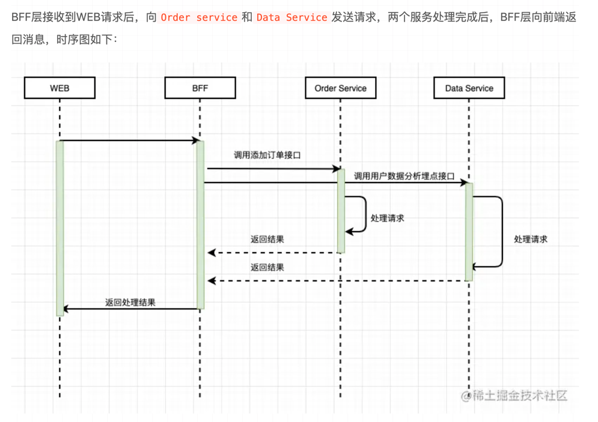
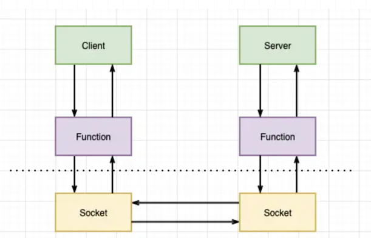
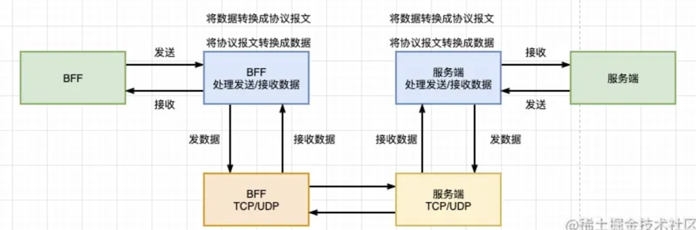
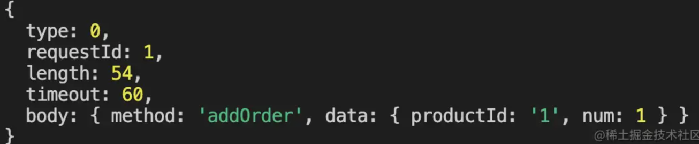
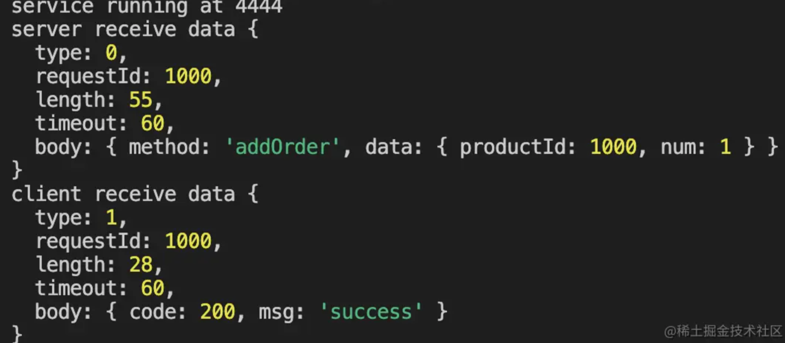

[参考文章](https://juejin.cn/post/6996935339386339336)
## BFF
构建BFF(Backend For FrontEnd)层

前端需要满足业务需求，一个功能不得不调用两个或多个微服务接口才能完成业务


### BFF能做什么


服务聚合
上文提到，BFF层可以将业务中的多个微服务整合起来，对外只暴露一个接口点，前端只需调用一个接口和关注数据的传输，无需关注微服务复杂的调用。


缓存数据
BFF层对接的是前端请求，作为业务请求微服务的处理点，它还可以做数据的缓存。


访问控制
服务中的权限控制，将所有服务中的权限控制集中在 BFF 层，使下层服务更加纯粹和独立。


### demo

```javascript

// 后端中有两个微服务：
//
// 一个是管理大数据系统的微服务，提供记录大数据信息和推送功能。
// 一个则是管理订单信息的微服务，提供订单的增删改查功能。
// 前端在下单的同时也需要调用大数据信息录入的功能。
```


```node
const http = require('http');

// 订单服务
const orderApp = http.createServer((req, res) => {
  handleOrderInput(req, res);
});

orderApp.listen(8081, () => {
  console.log('Order Server is running at 8081 port');
});

// 数据服务
const dataApp = http.createServer((req, res) => {
  handleDataInput(req, res);
});

dataApp.listen(8082, () => {
  console.log('Data Server is running at 8082 port');
});

function handleOrderInput(req, res) {
  switch (req.url) {
    case '/order/add':
      res.end('{ code: 200, msg: "success", data: "" }');
      break;
    default:
      res.end('{ code: 500, msg: "route not found", data: "" }');
      break;
  }
}

function handleDataInput(req, res) {
  switch (req.url) {
    case '/data/add':
      res.end('{ code: 200, msg: "success", data: "" }');
      break;
    default:
      res.end('{ code: 500, msg: "route not found", data: "" }');
      break;
  }
}


```

创建bff层

```node
const http = require('http');
const BFF = http.createServer((req, res) => {
  handleBFF(req, res);
});

BFF.listen(8080, () => {
  console.log('BFF Server is running at 8080 port');
});

function handleBFF(req, res) {
  switch (req.url) {
    case '/order/add':
      addOrder(req, res);
      break;
    default:
      res.end('{ code: 500, msg: "route not found", data: "" }');
      break;
  }
}

// 处理添加订单方法
function addOrder(req, res) {
  if (req.method !== 'POST') {
    res.end('{ code: 500, msg: "route not found", data: "" }');
    return;
  }

  let data = '';
  req.on('data', (chunk) => {
    data += chunk;
  });

  req.on('end', async () => {
    const orderResult = await publicRequest(
      'http://localhost:8081/order/add',
      data
    );
    const dataResult = await publicRequest(
      'http://localhost:8082/data/add',
      data
    );
    res.end(JSON.stringify({ orderResult, dataResult }));
  });
}

// 公共请求方法
async function publicRequest(url, data) {
  return new Promise((resolve) => {
    const request = http.request(url, (response) => {
      let resData = '';
      response.on('data', (chunk) => {
        resData += chunk;
      });
      response.on('end', () => {
        resolve(resData.toString());
      });
    });

    request.write(data);
    request.end();
  });
}

```


### 优化BFF层

- RPC远程过程调用

  简单的理解是一个节点请求另一个节点提供的服务，他是基于TCP的数据传输，数据会直接在传输层完成传输。
- 服务端与客户端基于socket链接。数据传输的图如下：



- 实现RPC

RPC通过传输层协议传输数据，传输层传输的是二进制数据，发送端需要将请求的方法名和数据序列化后发送，
接收端接收到二进制数据后则需要反序列化并处理数据。所以，RPC调用的流程大致如下


```text

根据上图的流程，实现设计一个简单的通信通信协议并且实现它，利用这个协议进行通信。这个协议由报文头和报文主体组成
报文头主要有的信息:
| --- type --- | ------- requestId ------- | ---- length ---- | --- timeout --- |
| ------------------------------------------------------------------------ |
| ---------------------------------- body -------------------------------- |
| ------------------------------------------------------------------------ |

报文头的长度是固定的
type是请求的类型，占1个字节: 规定 0 - REQUEST 1 - RESPONSE
requestId请求的ID，占4个字节：范围 0 ~ 4 * 2^8
length报文主体长度，占4个字节
timeout响应超时事件，规则报文双文，占1个字节

到这里，一个简单的报文已经设计完成，其中，header一共占10个字节，接下来就是要在代码中描述它
```


- node描述报文
```node
// 需要发送的信息
const body = {
  method: 'addOrder',
  data: {
    productId: '1',
    num: 1,
  },
};

// 请求报文
const bodyLength = JSON.stringify(body).length;
const bodyBuf = Buffer.alloc(bodyLength, JSON.stringify(body));
const bufHeader = Buffer.alloc(10);
bufHeader[0] = 0; // 代表request
bufHeader.writeInt32BE(1, 1); // 写入4字节数据 代表订单号为1
bufHeader.writeInt32BE(bodyLength, 5);
bufHeader[9] = 60;
console.log(bufHeader); // <Buffer 00 00 00 00 01 00 00 00 36 3c>

// 组合报文
const buf = Buffer.concat([bufHeader, bodyBuf]);

console.log(buf); // <Buffer 00 00 00 00 01 00 00 00 36 3c 7b 22 6d 65 74 68 6f 64 22 3a 22 61 64 64 4f 72 64 65 72 22 2c 22 64 61 74 61 22 3a 7b 22 70 72 6f 64 75 63 74 49 64 22 ... 14 more bytes>

```

- 解码
```node
// 反序列化方法
function decodeBuf(buf) {
    const type = buf[0];
    const requestId = buf.readInt32BE(1);
    const length = buf.readInt32BE(5);
    const timeout = buf[9];
    
    const body = buf.split(10, 10 + length);
    
    return {
        type,
        requestId,
        length,
        timeout,
        body: json.parse(body),
    }
}

console.log(decodeBuf(buf));

```


- 用node实现rpc框架 (使用net库)
   
创建服务方法
```node
import { createServer, createConnection } from 'net';

// 创建服务方法
export function createService() {
  const service = createServer((socket) => {
    socket.on('connect', () => {
      console.log('connect server');
    });

    socket.on('data', (data) => {
      const result = decodeBuf(data);
      // 如果是心跳包，直接跳过
      if (result.body.method === 'jump') return;
      else {
        // 否则处理方法
        console.log('server receive data', result);
        socket.write(
          encodeBuf(1, result.requestId, { code: 200, msg: 'success' })
        );
      }
    });

    socket.on('end', () => {
      console.log('disconnect server');
    });
  });

  service.listen(4444, () => {
    console.log(`service running at 4444`);
  });
}

```

创建一个客户端
```node
// 创建一个客户端
import { createServer, createConnection } from 'net';

export function createClient() {
  const client = createConnection({
    port: 4444,
  });
  client.write(
    encodeBuf(0, 1000, {
      method: 'addOrder',
      data: { productId: 1000, num: 1 },
    })
  );
  // 接收信息
  client.on('data', (data) => {
    console.log('client receive data', decodeBuf(data));
  });

  client.on('close', () => {
    console.log('client connect close');
  });
}
```

序列化和反序列化
```node

// 序列化报文
function encodeBuf(type, order, data) {
  const bodyLength = JSON.stringify(data).length;
  const bodyBuf = Buffer.alloc(bodyLength, JSON.stringify(data));
  const bufHeader = Buffer.alloc(10);
  bufHeader[0] = type;
  bufHeader.writeInt32BE(order, 1);
  bufHeader.writeInt32BE(bodyLength, 5);
  bufHeader[9] = 60;
  const buf = Buffer.concat([bufHeader, bodyBuf]);
  return buf;
}

// 反序列化报文
function decodeBuf(buf: any) {
  const type = buf[0];
  const requestId = buf.readInt32BE(1);
  const length = buf.readInt32BE(5);
  const timeout = buf[9];
  const body = buf.slice(10, 10 + length);

  return {
    type,
    requestId,
    length,
    timeout,
    body: JSON.parse(body),
  };
}

// 调用测试
createService();
// 一秒后发送请求
setTimeout(() => {
  createClient();
}, 1000);
```

返回结果



### 优化BFF层
```node
import { createServer, createConnection } from 'net';

export function createService(port, callback) {
  const service = createServer((socket) => {
    socket.on('connect', () => {
      console.log('connect server');
    });

    socket.on('data', (data) => {
      const result = decodeBuf(data);
      if (result.body.method === 'jump') {
				return;
      }
      else {
        console.log('server receive data', result);
        // 处理钩子
        const returnData = callback(result, socket);
        socket.write(encodeBuf(1, result.requestId, returnData));
      }
    });
  });

  service.listen(port, () => {
    console.log(`service running at ${port}`);
  });
}

export function createClient(port: number) {
  const client = createConnection({
    port,
  });
  return client;
}

```
将微服务中的HTTP服务改为刚刚创建的网络服务
```node
// 订单服务
createService(4444, (data) => {
  const result = handleOrderInput(data.body);
  return result;
});

// 数据服务
createService(4445, (data) => {
  const result = handleDataInput(data.body);
  return result;
});

```
修改一下公共方法
```node
// 公共请求方法
async function publicRequest(port, method, data) {
  return new Promise((resolve) => {
    const json = { method, ...JSON.parse(data) };
    const buf = encodeBuf(0, 1001, json);
    const client = createClient(port);
    client.write(buf);
    client.on('data', (data) => {
      const result = decodeBuf(data);
      console.log('client receive data', result);
      resolve(result);
    });
  });
}


```
