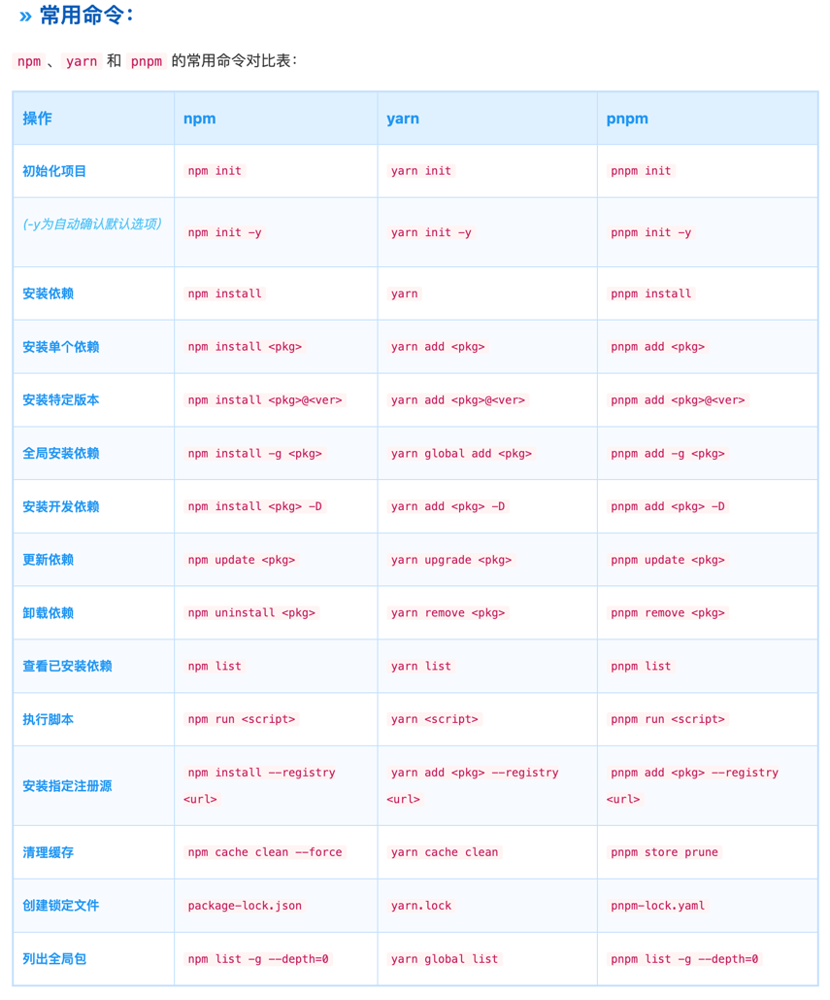

### npm
npm（Node Package Manager）是Node.js的默认包管理工具，用于管理项目依赖和发布Node.js模块。它是最常用的包管理工具之一。

特点

- 庞大的生态系统：npm拥有最大的包生态系统，几乎所有的Node.js开发者都使用npm。
- 默认安装：npm是Node.js的默认包管理工具，安装Node.js时会自动安装npm。
- 简单易用：使用npm管理包非常简单，常见命令包括npm install、npm uninstall、npm update等。

优缺点
优点
  - 生态系统庞大，社区活跃。
  - 简单易用，默认安装。

缺点 
  - 安装速度较慢，依赖树结构复杂，可能导致重复安装依赖。

### pnpm
pnpm（Performant npm）是一种高性能的包管理工具，通过硬链接和符号链接的方式来共享依赖，节省磁盘空间并提升安装速度。

特点
- 性能优越：pnpm的安装速度比npm和yarn更快，特别是在大型项目中表现尤为突出。
- 磁盘空间节省：通过硬链接和符号链接的方式共享依赖，避免重复安装包，节省磁盘空间。
- 严格的依赖管理：pnpm默认会创建一个隔离的node_modules，确保项目依赖一致性。

优缺点
优点
  - 安装速度快，性能优越。
  - 节省磁盘空间，依赖管理严格。
缺点
  - 生态系统和社区相对较小。

### yarn
yarn是由Facebook推出的一款包管理工具，旨在解决npm的一些性能和安全性问题。yarn在安装速度、安全性和一致性方面进行了优化。

特点
- 并行安装：yarn通过并行安装包的方式提升安装速度。
- 离线模式：yarn会缓存已下载的包，可以在离线状态下安装依赖。
- 一致性：yarn使用yarn.lock文件确保依赖版本一致性。

优缺点
优点
  - 安装速度快，并行安装。
  - 离线模式和一致性好。
缺点
  - 在某些情况下，yarn.lock文件可能导致版本冲突。

### cnpm

简介
cnpm（China npm）是阿里巴巴开发的一款包管理工具，主要用于解决国内开发者使用npm时的网络问题。cnpm通过设置镜像源加速包的下载速度。

特点
- 国内镜像：cnpm使用国内镜像源，解决国内网络访问npm慢的问题。
- 与npm兼容：cnpm的命令与npm基本兼容，使用起来非常方便。

优缺点
优点
  - 解决国内网络问题，加速包下载速度。
  - 与npm命令兼容，使用方便。

缺点 
  - 需要额外安装，与npm相比，生态系统和社区相对较小。

## 常用命令

