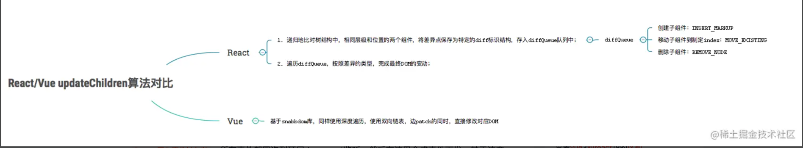
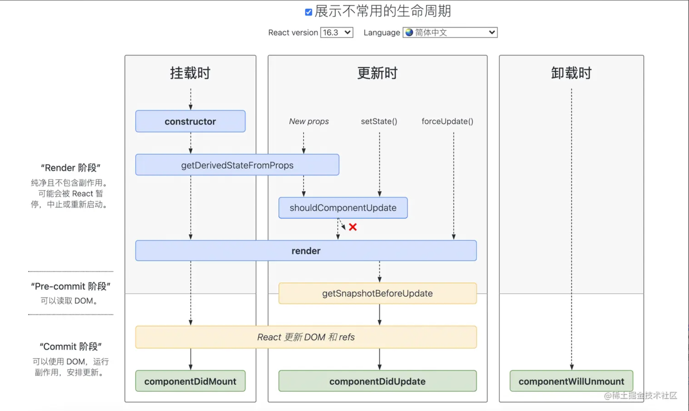

## 不同点
### 框架层面

```text

从React是UI库，而Vue是框架上可以看出，React的封装程度较低，主要负责组件的渲染和生命周期执行；
为了编写的方便引入了JSX语法，在编写时HTML标签只是有着特殊数据结构的JS对象（即HTML标签经JSX转换为虚拟DOM）；
引入的概念和API少，完全是使用JS自身的语法来写代码。

而Vue在生命周期上和React相似，但在HTML上使用了模板语言，因而引入了指令、过滤器、插槽的概念
```


### 核心思想不同
```text
Vue

Vue定位简单易上手，基于template模板 + options API

依然会定位简单易上手（渐进式开发），依然是考虑通过依赖收集来实现数据可变。
这点从Vue3核心更新内容可以看到：template语法基本不变、options api只增加了setup选项（composition api）、
基于依赖收集（Proxy）的数据可变。

React
函数式编程这个基本盘不会变。React核心思想，是把UI作为Basic Type，比如String、Array类型，
然后经过render处理，转换为另外一个value（纯函数）。从React Hooks可以看出，React团队致力于组件函数式编程，
（纯组件，无class组件），尽量减少副作用（减少this，this会引起副作用）。


React推崇JSX、HOC、all in js
React本质上核心只有一个Virtual DOM + Diff算法

```

### 组件实现不同
```text
Vue
源码实现是把options挂载到Vue核心类上，然后再new Vue({options})拿到实例
（vue组件的script导出的是一个挂满options的纯对象而已）。所以options api中的this指向内部Vue实例，
对用户是不透明的，所以需要文档去说明this.slot、this.slot、this.slot、this.xxx这些api。
另外Vue插件都是基于Vue原型类基础之上建立的，这也是Vue插件使用Vue.install的原因，
因为要确保第三方库的Vue和当前应用的Vue对象是同一个。


React
内部实现比较简单，直接定义render函数以生成VNode，而React内部使用了四大组件类包装VNode，
不同类型的VNode使用相应的组件类处理，职责划分清晰明了（后面的Diff算法也非常清晰）。
React类组件都是继承自React.Component类，其this指向用户自定义的类，对用户来说是透明的。
```

### 响应原理不同

```text
Vue

Vue依赖收集，自动优化，数据可变。
Vue递归监听data的所有属性,直接修改。
当数据改变时，自动找到引用组件重新渲染。

React

React基于状态机，手动优化，数据不可变，需要setState驱动新的State替换老的State。
当数据改变时，以组件为根目录，默认全部重新渲染

```

### diff算法

React 的 diff 算法：

React 使用的是一种基于层级的 diff 算法。当组件的状态发生变化时，React 会比较当前虚拟 DOM 树和上一次更新后的虚拟 DOM 树的差异。
React diff 算法会首先比较两棵树的根节点，如果节点类型不同，则直接删除旧节点，插入新节点；如果节点类型相同，则会继续比较子节点。（核心思想是比较和替换节点）
React diff 算法会使用一些启发式的策略来尽可能地减少 DOM 操作的次数，例如将子节点列表转换为 key-value 的形式，以便更快地找到需要更新的节点。
（必须有key）

Vue 的 diff 算法：

Vue 使用的是一种双端比较的 diff 算法。当组件的状态发生变化时，Vue 会同时从新旧虚拟 DOM 树的两端开始比较，找到最长的相同子序列。
Vue 会对动态节点进行跟踪，如果一个节点在新旧虚拟 DOM 中位置发生了变化，Vue 会尽可能地将其移动到新的位置，而不是删除和重新插入节点。（核心思想是移动复用节点）
Vue 的 diff 算法会通过动态规划的方式找到最优的更新策略，以最小化 DOM 操作的次数。
（可以没有key）





react 生命周期

