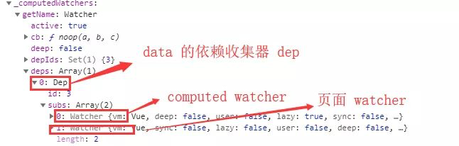
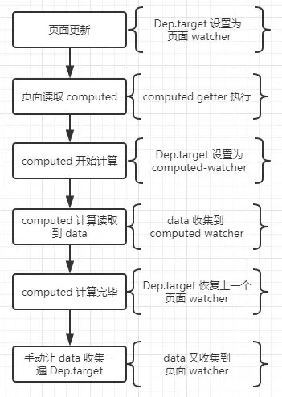

初始化
```javascript
function Vue(){
    // ... 其他处理
    initState(this)

    // ...解析模板，生成DOM 插入页面
}

function initState(vm) {    
    var opts = vm.$options;    
    if (opts.computed) { 
        initComputed(vm, opts.computed); 
    }
    // .....
}
```

1、保存设置的 getter。

  把用户设置的 computed-getter，存放到 watcher.getter 中，用于后面的计算

2、watcher.value 存放计算结果，但是这里有个条件，因为 lazy 的原因，不会新建实例并马上读取值

  这里可以算是 Vue 的一个优化，只有你再读取 computed，再开始计算，而不是初始化就开始计算值了
  
  虽然没有一开始计算，但是计算 value 还是这个 watcher.get 这个方法，来看下源码（已省略部分代码，下面讲其他问题，会更详细展示出来）

3、computed 新建 watcher 的时候，传入 lazy

  没错，作用是把计算结果缓存起来，而不是每次使用都要重新计算
  
  而这里呢，还把 lazy 赋值给了 dirty，为什么呢？
  
  因为 lazy 表示一种固定描述，不可改变，表示这个 watcher 需要缓存
  
  而 dirty 表示缓存是否可用，如果为 true，表示缓存脏了，需要重新计算，否则不用
  
  dirty 默认是 false 的，而 lazy 赋值给 dirty，就是给一个初始值，表示 你控制缓存的任务开始了
  
  所以记住，【dirty】 是真正的控制缓存的关键，而 lazy 只是起到一个开启的作用

```javascript

/*
initComputed 这段代码做了几件事
1、每个 computed 配发 watcher
2、defineComputed 处理
3、收集所有 computed 的 watcher
 */
function initComputed(vm, computed) {
    var watchers = vm._computedWatchers =  Object.create(null);    

    for (var key in computed) {        
        var userDef = computed[key];        
        var getter =  typeof userDef === 'function' ?  userDef : userDef.get;      
        // 每个 computed 都创建一个 watcher
        // watcher 用来存储计算值，判断是否需要重新计算
        watchers[key] =  new Watcher(vm, getter, { lazy: true });        

        // 判断是否有重名的属性

        if (! (key in vm)) {
            defineComputed(vm, key, userDef);
        }
    }
}

function Watcher(vm, expOrFn, options) {
	this.dirty = this.lazy = options.lazy;
	this.getter = expOrFn;
	this.value = this.lazy ? undefined: this.get();
}

```

```javascript
function defineComputed(target, key, userDef) {    

    // 设置 set 为默认值，避免 computed 并没有设置 set
    var set = function(){}      
    //  如果用户设置了set，就使用用户的set

    if (userDef.set) {
			set = userDef.set
    }   

    Object.defineProperty(target, key, {        
        // 包装get 函数，主要用于判断计算缓存结果是否有效
        get:createComputedGetter(key),        
        set:set
    });
}
```

```javascript
function createComputedGetter(key) {    
    return function() {        

        // 获取到相应 key 的 computed-watcher

        var watcher = this._computedWatchers[key];        

        // 如果 computed 依赖的数据变化，dirty 会变成true，

        // 从而重新计算，然后更新缓存值 watcher.value
        if (watcher.dirty) {
            watcher.evaluate();
        }        

        // 这里是 月老computed 牵线的重点，让双方建立关系

        if (Dep.target) {
            watcher.depend();
        }        
        return watcher.value
    }
}
```

```javascript

Watcher.prototype.evaluate = function() {

	this.value = this.get();

	// 执行完更新函数之后，立即重置标志位

	this.dirty = false;
};
Watcher.prototype.update = function() {

	if (this.lazy)  this.dirty = true;

// ....还有其他无关操作，已被省略

};

Watcher.prototype.get = function() {    
    // 改变 Dep.target

    pushTarget()    

    // getter 就是 watcher 回调

    var value = this.getter.call(this.vm, this.vm);    
    // 恢复前一个 watcher

    popTarget()    

    return value

};


Dep.target = null;

var targetStack = [];

function pushTarget(_target) {    

    // 把上一个 Dep.target 缓存起来，便于后面恢复

    if (Dep.target) {
        targetStack.push(Dep.target);
    }
    Dep.target = _target;

}


function popTarget() {

    Dep.target = targetStack.pop();
}
```

详细流程:

1、页面更新，读取 computed 的时候，Dep.target 会设置为 页面 watcher。

2、computed 被读取，createComputedGetter 包装的函数触发，第一次会进行计算

computed-watcher.evaluted 被调用，进而 computed-watcher.get 被调用，Dep.target 被设置为 computed-watcher，旧值 页面 watcher 被缓存起来。

3、computed 计算会读取 data，此时 data 就收集到 computed-watcher

同时 computed-watcher 也会保存到 data 的依赖收集器 dep（用于下一步）。

computed 计算完毕，释放Dep.target，并且Dep.target 恢复上一个watcher（页面watcher）

4、手动 watcher.depend， 让 data 再收集一次 Dep.target，于是 data 又收集到 恢复了的页面watcher



