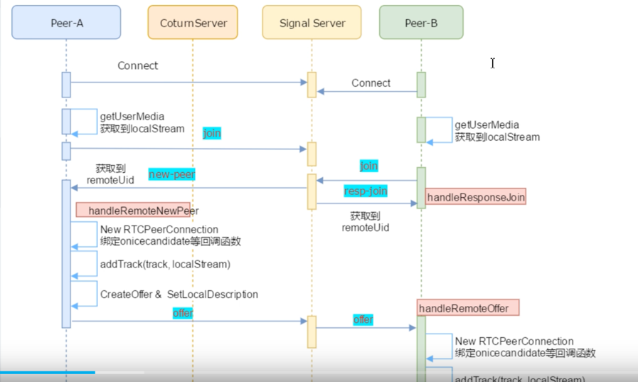

webrtc (web real time communication)




存在的问题:
  如何发现对方
  不同的音视频编解码能力如何沟通
  如何联系对方

信令服务器(房间服务器)
WebRTC专门协议 SDP(Session Description Protocol)
candidate 
ICE工作原理:
1 通信双方收集本地网络地址(包括私有地址和公有地址)以及通过STUN和TURN服务器获取的候选地址
2. 双方通过信令服务器交换候选地址
3. 通信双方使用这些候选地址进行连接测试,确定最佳可用地址
4. 一旦找到可用地址,通信双方就可以开始实时音视频通话


### node搭建websocket服务
```javascript
const io = socket(server, {
	cors: {
		origin: '*'
  }
})
io.on('connetction', sock => {
	sock.emit('connectionSuccess')
  
  sock.on('joinRoom', ({ roomId }) => {
		sock.join(roomId)
  })
  
  sock.on('callRemote', roomId => {
		io.to(roomId).emit('callRemote')
  })

	sock.on('acceptCall', roomId => {
		io.to(roomId).emit('acceptCall')
	})

	sock.on('sendOffer', (offer, roomId) => {
		io.to(roomId).emit('sendOffer', offer)
	})
  
  // 接受answer
	sock.on('sendAnswer', (answer, roomId) => {
		io.to(roomId).emit('sendAnswer', answer)
	})
  
  // 监听candidate
	sock.on('sendCandidate', (candidate, roomId) => {
		io.to(roomId).emit('sendAnswer', candidate)
	})
})
```

### vue项目监听
```vue
<template>
	<div class="flex items-center flex-col text-center p-12 h-screen">
		<div class="relative h-full mb-4 fBox">
			<video id="localVideo"></video>
			<video id="remoteVideo"></video>
			<div v-if="caller && calling">
				<p class="mb-4 text-white">等待对方接听...</p>
				
			</div>
			<div v-if="called && calling">
				<p>收到视频邀请...</p>
				<div class="flex">
					
					
				</div>
			</div>
		</div>
		<div>
			<button @click="callRemote" style="margin-right: 10px">发起视频</button>
		<button @click="hangUp" style="margin-left: 10px">挂断视频</button>
</div>
</div>
</template>

```
```javascript

import { ref } from "vue";

import { io } from "socket.io-client";

const roomId = '001'
const called = ref(false) // 接收方
const caller = ref(false) // 发送方
const calling = ref(false) // 呼叫中
const communicating = ref(false) // 视频通话中
const localVideo = ref() // 播放本人视频
const remoteVideo = ref() // 播放对方视频

const socket = ref()
const peer = ref()
const localStream = ref()

onMounted(() => {
	const sock = io('http://localhost:3000')
	socket.value = sock
  sock.on('connectionSuccess', () => {
		console.log('链接成功')
    sock.emit('joinRoom', { roomId })
  })
  
  sock.on('callRemote', () => {
		//  不是发送方
		if(!caller.value) {
			called.value = true
			calling.value = true
    }
  })

	sock.on('acceptCall', async () => {
		//  是发送方
		if(caller.value) {
			peer.value = new RTCPeerConnection()
      // 添加本地音视频流
      peer.value.addStream(localStream.value)
      
      
      // 通过监听onicecandidate获取candidate信息
      peer.value.onicecandidate = event => {
				if(event.candidate) {
					socket.value.emit('sendCandidate', { roomId, candidate: event.cadidate})
        }
      }
			
			peer.value.onaddStream = event => {
				// 发送方收到接收方stream
        communicating.value = true
        calling.value = false
        remoteVideo.value.srcObject = event.stream
				remoteVideo.value.play()
      }
      
      // 生成offer
      const offer = peer.value.createOffer({
        offerToReceiveAudio: 1,
        offerToReceiveVideo: 1,
      })
      // 在本地设置用户信息
      await peer.value.setLocalDescription(offer)
      // 发送offer
      socket.value.emit('sendOffer', { offer, roomId})
		}
	})

	sock.on('sendOffer', async (offer) => {
		// 接收方
		if(called.value) {
			peer.value = new RTCPeerConnection()
      const stream = await getLocalStream()
			// 添加本地音视频流
			peer.value.addStream(stream)


			// 通过监听onicecandidate获取candidate信息
			peer.value.onicecandidate = event => {
				if(event.candidate) {
					socket.value.emit('sendCandidate', { roomId, candidate: event.cadidate})
				}
			}

			peer.value.onaddStream = event => {
				// 接收方收到发送方stream
				communicating.value = true
				calling.value = false
				remoteVideo.value.srcObject = event.stream
				remoteVideo.value.play()
			}
      // 设置远端描述信息SDP
			await peer.value.setRemoteDescription(offer)
      
      // 生成answer
      const answer = await peer.value.createAnswer()
      
      await peer.value.setLocalDescription(answer)
      sock.value.emit('sendAnswer', { answer, roomId})
    }
	})
  
  sock.on('sendAnswer', async (answer) => {
		// 发送方接受answer
    if(caller.value) {
			await peer.value.setRemoteDescription(answer)
    }
  })


	sock.on('sendCandidate', async (candidate) => {
		
			await peer.value.addIceCandidate(candidate)
	})
  
  
  
})

// 发起视频
const callRemote = async () => {
	caller.value = true
  calling.value = true
	await getLocalStream()
	socket.value?.emit('callRemote', roomId)
}

// 同意视频信息
const acceptCall = () => {
	socket.value?.emit('acceptCall', roomId)
}

// 挂断视频
const hangUp = () => {
	calling.value = false
	sock.emit('hangUp', roomId)
}

// 获取当前用户的视频和音频
const getLocalStream = async () => {
	const stream = await navigator.mediaDevices.getUserMedia({
    audio: true,
    video: true
  })
  localVideo.value.srcObject = stream
  localVideo.value.play()
	localStream.value = stream
  return stream
}

```

peer
```javascript
const { PeerServer } = require('peer')
const pServer = PeerServer({port: 3000, path: '/myPeerServer'})
```
peer.js
```javascript
import Peer from "peerjs";

```

### RTCPeerConnection
configuration


### 部署公网
防火墙 coturn涉及到3478 是否开放
配置支持https
