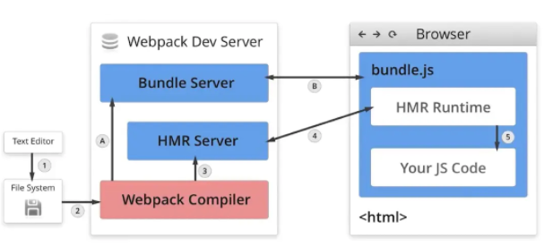
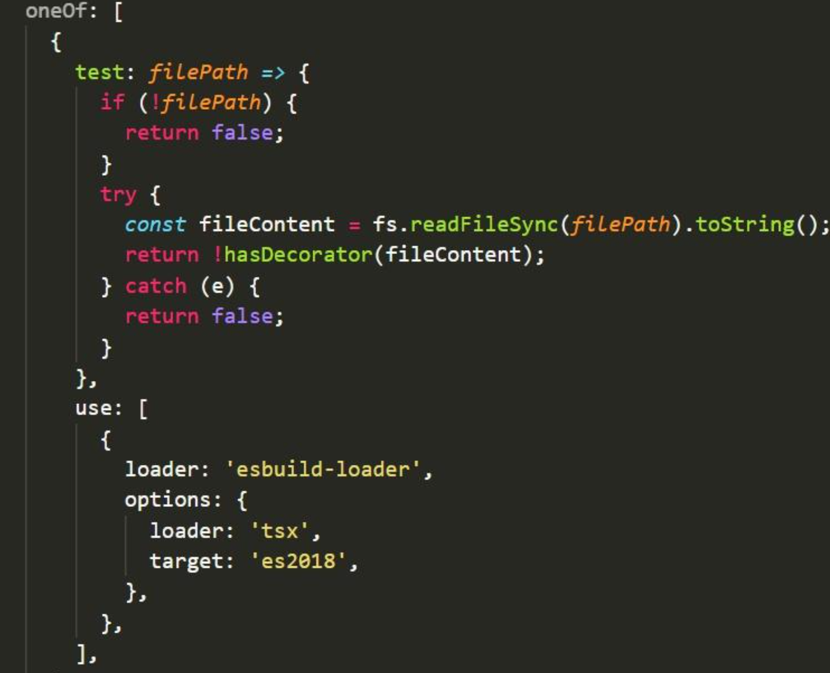
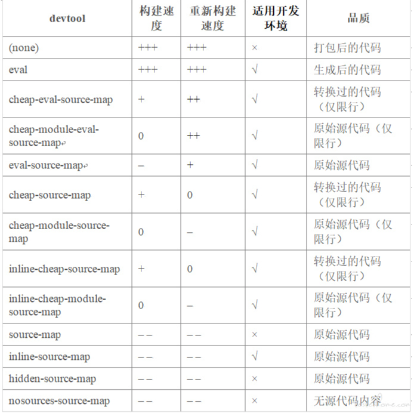

## webpack 性能优化

[webpack详解](https://zhuanlan.zhihu.com/p/363928061)

### ParallelUglifyPlugin

```
使用HappyPack开启多进程Loader转换
	 use:['happypack/loader?id=css']
 ParallelUglifyPlugin开启多进程压缩JS文件
 	new ParallelUglifyPlugin({
        uglifyJS:{ //...这里放uglifyJS的参数
        },
        //...其他ParallelUglifyPlugin的参数，设置cacheDir可以开启缓存，加快构建速度
    })

自动刷新
	--watch
	devserver
		向网页中注入代理客户端代码，通过客户端发起刷新
		向网页装入一个iframe，通过刷新iframe实现刷新效果


压缩代码体积
	const DefinePlugin = require('webpack/lib/DefinePlugin');
	plugins:[
	    new DefinePlugin({
	        'process.env': {
	            NODE_ENV: JSON.stringify('production')
	        }
	    })
	]
```

### UglifyJSPlugin

```
const UglifyJSPlugin = require('webpack/lib/optimize/UglifyJsPlugin');
 	new UglifyJSPlugin({
        compress: {
            warnings: false,  //删除无用代码时不输出警告
            drop_console: true,  //删除所有console语句，可以兼容IE
            collapse_vars: true,  //内嵌已定义但只使用一次的变量
            reduce_vars: true,  //提取使用多次但没定义的静态值到变量
        },
        output: {
            beautify: false, //最紧凑的输出，不保留空格和制表符
            comments: false, //删除所有注释
        }
    })


```

压缩CSS：css-loader?minimize、PurifyCSSPlugin

```
	cssnano基于PostCSS，不仅是删掉空格，还能理解代码含义，例如把color:#ff0000 转换成 color:red，css-loader内置了cssnano，只需要使用 css-loader?minimize 就可以开启cssnano压缩。
	另外一种压缩CSS的方式是使用PurifyCSSPlugin，需要配合 extract-text-webpack-plugin 使用，它主要的作用是可以去除没有用到的CSS代码，类似JS的Tree Shaking。


```

treeshaking

```
	前提是代码必须采用ES6的模块化语法
	.babelrc
    "presets": [[
        "env",
        { "module": false },   //关闭Babel的模块转换功能，保留ES6模块化语法
    ]]

添加resolve  可配置 mainFields  alias extensions 属性   减少文件查找范围

module.noParse
    module: {
        noParse: [/jquery|lodash, /react\.min\.js$/]
    }
```

预渲染

```
prerender-spa-plugin插件，预渲染极大地提高了首屏加载速度。其原理是此插件在本地模拟浏览器环境，
预先执行我们打包的文件，返回预先解析的首屏html。使用方法入如下：

    module.exports = {
    plugins: [
            new PrerenderSPAPlugin({
                // 生成文件的路径，也可以与webpakc打包的一致。
                staticDir: path.join(__dirname, '../dist'),
                // 要预渲染的路由
                route: [ '/', '/team', '/analyst','/voter','/sponsor'],
                // 这个很重要，如果没有配置这段，也不会进行预编译
                renderer: new Renderer({
                    // headless: false,
                    renderAfterDocumentEvent: 'render-event',
                    // renderAfterTime: 5000
                })
            })
        ]
    }

new Vue({
  // ...
  mounted() {
    document.dispatchEvent(new Event('render-event'));
  },
}).$mount('#app');

```

splitChunks 合成文件

cdn 加速

```

	用户可以就近访问资源，加快访问速度

	HTTP1.x版本的协议下，浏览器会对于向同一域名并行发起的请求数限制在4~8个。
	那么把所有静态资源放在同一域名下的CDN服务上就会遇到这种限制，所以可以把他们分散放在不同的CDN服务上，

	例如JS文件放在js.cdn.com下，将CSS文件放在css.cdn.com下等。这样又会带来一个新的问题：增加了域名解析时间，
	这个可以通过dns-prefetch来解决  来缩减域名解析的时间。形如//xx.com 这样的URL省略了协议，这样做的好处是，
	浏览器在访问资源时会自动根据当前URL采用的模式来决定使用HTTP还是HTTPS协议

	构建需要满足以下几点：

	静态资源导入的URL要变成指向CDN服务的绝对路径的URL
	静态资源的文件名需要带上根据内容计算出的Hash值

	const ExtractTextPlugin = require('extract-text-webpack-plugin');
	const {WebPlugin} = require('web-webpack-plugin');
	//...
	output:{
	 filename: '[name]_[chunkhash:8].js',
	 path: path.resolve(__dirname, 'dist'),
	 publicPatch: '//js.cdn.com/id/', //指定存放JS文件的CDN地址
	},
	module:{
	 rules:[{
	     test: /\.css/,
	     use: ExtractTextPlugin.extract({
	         use: ['css-loader?minimize'],
	         publicPatch: '//img.cdn.com/id/', //指定css文件中导入的图片等资源存放的cdn地址
	     }),
	 },{
	    test: /\.png/,
	    use: ['file-loader?name=[name]_[hash:8].[ext]'], //为输出的PNG文件名加上Hash值
	 }]
	},
	plugins:[
	  new WebPlugin({
	     template: './template.html',
	     filename: 'index.html',
	     stylePublicPath: '//css.cdn.com/id/', //指定存放CSS文件的CDN地址
	  }),
	 new ExtractTextPlugin({
	     filename:`[name]_[contenthash:8].css`, //为输出的CSS文件加上Hash
	 })
	]


```

### CommonsChunkPlugin

```
多页面应用提取页面间公共代码，以利用缓存
CommonsChunkPlugin   把多个页面依赖的公共代码提取到common.js

	const CommonsChunkPlugin = require('webpack/lib/optimize/CommonsChunkPlugin');
	//base.js
	import 'react';
	import 'react-dom';
	import './base.css';

	//webpack.config.json
	entry:{
	    base: './base.js'
	},
	plugins:[
	    new CommonsChunkPlugin({
	        chunks:['base','common'],
	        name:'base',
	        //minChunks:2,表示文件要被提取出来需要在指定的chunks中出现的最小次数，防止common.js中没有代码的情况
	    })
	]


```

### LimitChunkCountPlugin

分割代码以按需加载
限制chunk分割数量，减小HTTP请求开销
```
	//main.js
	document.getElementById('btn').addEventListener('click',function(){
	    import(/* webpackChunkName:"show" */ './show').then((show)=>{
	        show('Webpack');
	    })
	})

	//show.js
	module.exports = function (content) {
	    window.alert('Hello ' + content);
	}
```

## loader

```javascript
module.exports = function (source) {
  return source.replace(/var/g, 'const') // var 替换成const
}
// 异步loader
module.exports = function (source) {
  const callback = this.async() // webpack 的async 方法

  // 由于有 3 秒延迟，所以打包时需要 3+ 秒的时间
  setTimeout(() => {
    callback(null, `${source.replace(/;/g, '')}`)
  }, 3000)
}
```

```javascript
// 配置文件  rules: [{ test: /\.txt$/, use: "raw-loader" }],
// 内联方式 import Styles from "style-loader!css-loader?modules!./styles.css";
// inline loader一样可以传递options，通过?key=value&foo=bar这种方式

// webpack 自带的功能只能处理 javaScript 和 JSON 文件
// loader 让 webpack 能够去处理其他类型的文件，并将它们转换成有效的模块，以及被添加到依赖图中
// 如果有多个loader, loader 的执行顺序从下到上
// 单一职责 链式组合 模块化 无状态 使用loader工具(loader-utils)


// 可以在webpack.config.js 中配置
{
  resolveLoader: {
    // 告诉 webpack 该去那个目录下找 loader 模块
    modules: ['node_modules', path.resolve(__dirname, 'loaders')]
  }
}

// 处理顺序排在最后的 loader
module.exports = function (source) {
  // 这个 loader 的功能是把源模块转化为字符串交给 require 的调用方
  return 'module.exports = ' + JSON.stringify(source)
}
```

## loader 的分类

```
按执行顺序，loader 可以这么划分：

preLoader。enforce 被设置成 pre 的 loader
postLoader。enforce 被设置成 post 的 loader
normal loader。在配置文件中配置的并且没有设置 enforce 属性的普通 loader
inline loader。在 import 语句中使用的 loader

loader 的执行顺序
默认情况下，loader 按照我们在配置文件中配置的 module.rules 从下往上，从右到左依次执行。
实际上，loader 会按照下面的顺序执行：

先执行 preLoader
其次执行 normal loader
然后执行 inline loader
最后执行 postLoader

```

## plugin

```
// 插件可以执行范围更广的任务，包括打包优化，资源管理，注入环境变量
// webpack 在整个编译周期中会触发很多不同的事件，plugin 可以监听这些事件，并且可以调用 webpack 的 API 对输出资源进行处理

    在插件开发中最重要的两个资源就是 compiler 和 compilation 对象
        compiler 对象代表了完整的 webpack 环境配置。这个对象在启动 webpack 时被一次性建立，并配置好所有可操作的设置，
        包括 options，loader 和 plugin。当在 webpack 环境中应用一个插件时，插件将收到此 compiler 对象的引用。
        可以使用它来访问 webpack 的主环境。

        compilation 对象代表了一次资源版本构建。
        当运行 webpack 开发环境中间件时，每当检测到一个文件变化，就会创建一个新的 compilation，从而生成一组新的编译资源。
        一个 compilation 对象表现了当前的模块资源、编译生成资源、变化的文件、以及被跟踪依赖的状态信息。
        compilation 对象也提供了很多关键时机的回调，以供插件做自定义处理时选择使用。


```

```javascript
// 插件的组成部分
//    一个 JavaScript 命名函数。 (构造函数)
//     在插件函数的 prototype 上定义一个 apply 方法。
//     指定一个绑定到 webpack 自身的事件钩子。
//     处理 webpack 内部实例的特定数据。
//     功能完成后调用 webpack 提供的回调。
function Plugin(options) {}

Plugin.prototype.apply = function (compiler) {
  // 所有文件资源都被 loader 处理后触发这个事件
  compiler.plugin('emit', function (compilation, callback) {
    // 功能完成后调用 webpack 提供的回调
    console.log('Hello World')
    callback()
  })
}

module.exports = Plugin
```

```javascript
// 复杂demo
function Plugin(options) {}

Plugin.prototype.apply = function (compiler) {
  // 所有文件资源经过不同的 loader 处理后触发这个事件
  compiler.plugin('emit', function (compilation, callback) {
    // 获取打包后的 js 文件名
    const filename = compiler.options.output.filename
    // 生成一个 index.html 并引入打包后的 js 文件
    const html = `<!DOCTYPE html>
                <html lang="en">
                <head>
                    <meta charset="UTF-8">
                    <meta name="viewport" content="width=device-width, initial-scale=1.0">
                    <title>Document</title>
                    <script src="${filename}"></script>
                </head>
                <body>
                    
                </body>
                </html>`
    // 所有处理后的资源都放在 compilation.assets 中
    // 添加一个 index.html 文件
    compilation.assets['index.html'] = {
      source: function () {
        return html
      },
      size: function () {
        return html.length
      }
    }

    // 功能完成后调用 webpack 提供的回调
    callback()
  })
}

module.exports = Plugin
```

```javascript
// 获取版权信息的plugin

class CopyrightWebpackPlugin {
  //编写一个构造器
  constructor(options) {
    console.log(options)
  }

  apply(compiler) {
    //遇到同步时刻
    compiler.hooks.compile.tap('CopyrightWebpackPlugin', () => {
      console.log('compiler')
    })

    //遇到异步时刻
    //当要把代码放到dist目录之前，要走下面这个函数
    //Compilation存放打包的所有内容，Compilation.assets放置生成的内容
    compiler.hooks.emit.tapAsync('CopyrightWebpackPlugin', (Compilation, cb) => {
      // debugger;
      // 往代码中增加一个文件，copyright.txt
      Compilation.assets['copyright.txt'] = {
        source: function () {
          return 'copyright by monday'
        },
        size: function () {
          return 19
        }
      }
      cb()
    })
  }
}

module.exports = CopyrightWebpackPlugin
```

## 动态导入实现

```javascript
// https://juejin.cn/post/6844903888319954952
```

## 热更新原理

```
1. webpack-dev-server启动本地服务
    我们根据webpack-dev-server的package.json中的bin命令，可以找到命令的入口文件bin/webpack-dev-server.js

    启动webpack，生成compiler实例。compiler上有很多方法，比如可以启动 webpack 所有编译工作，以及监听本地文件的变化。
    使用express框架启动本地server，让浏览器可以请求本地的静态资源。
    本地server启动之后，再去启动websocket服务，如果不了解websocket，建议简单了解一下websocket速成。通过websocket，
    可以建立本地服务和浏览器的双向通信。这样就可以实现当本地文件发生变化，立马告知浏览器可以热更新代码啦！

2. 修改webpack.config.js的entry配置
    启动本地服务前，调用了updateCompiler(this.compiler)方法。这个方法中有 2 段关键性代码。
    一个是获取websocket客户端代码路径，
    另一个是根据配置获取webpack热更新代码路径。
    添加 clientEntry  hotEntry 一起打包打开bundle.js中
    webpack-dev-server/client/index.js    启动websocket
    webpack/hot/dev-server.js   检查更新逻辑的


3. 监听webpack编译结束
    修改好入口配置后，又调用了setupHooks方法。这个方法是用来注册监听事件的，监听每次webpack编译完成。
    当监听到一次webpack编译结束，就会调用_sendStats方法通过websocket给浏览器发送通知，
    ok和hash事件，这样浏览器就可以拿到最新的hash值了，做检查更新逻辑。

4. webpack监听文件变化
    主要是通过setupDevMiddleware方法实现的
    // node_modules/webpack-dev-middleware/index.js
    compiler.watch(options.watchOptions, (err) => {
        if (err) { /*错误处理*/ }
    });

    // 通过“memory-fs”库将打包后的文件写入内存
    setFs(context, compiler);

    （1）调用了compiler.watch方法，在第 1 步中也提到过，compiler的强大。这个方法主要就做了 2 件事：

    首先对本地文件代码进行编译打包，也就是webpack的一系列编译流程。
    其次编译结束后，开启对本地文件的监听，当文件发生变化，重新编译，编译完成之后继续监听。

    为什么代码的改动保存会自动编译，重新打包？这一系列的重新检测编译就归功于compiler.watch这个方法了。
    监听本地文件的变化主要是通过文件的生成时间是否有变化，这里就不细讲了。
    
    （2）执行setFs方法，这个方法主要目的就是将编译后的文件打包到内存。这就是为什么在开发的过程中，
    你会发现dist目录没有打包后的代码，因为都在内存中。原因就在于访问内存中的代码比访问文件系统中的文件更快，
    而且也减少了代码写入文件的开销，这一切都归功于memory-fs。

5. 浏览器接收到热更新的通知


```


- Webpack Compile：将 JS 源代码编译成 bundle.js
- HMR Server：用来将热更新的文件输出给 HMR Runtime
- Bundle Server：静态资源文件服务器，提供文件访问路径
- HMR Runtime：socket服务器，会被注入到浏览器，更新文件的变化
- bundle.js：构建输出的文件
- 在HMR Runtime 和 HMR Server之间建立 websocket，即图上4号线，用于实时更新文件变化
- 
上面图中，可以分成两个阶段：

启动阶段为上图 1 - 2 - A - B
在编写未经过webpack打包的源代码后，Webpack Compile 将源代码和 HMR Runtime 一起编译成 bundle 文件，传输给 Bundle Server 静态资源服务器

更新阶段为上图 1 - 2 - 3 - 4
当某一个文件或者模块发生变化时，webpack 监听到文件变化对文件重新编译打包，编译生成唯一的hash值，这个hash 值用来作为下一次热更新的标识

根据变化的内容生成两个补丁文件：manifest（包含了 hash 和 chundId ，用来说明变化的内容）和 chunk.js 模块

由于socket服务器在HMR Runtime 和 HMR Server之间建立 websocket链接，当文件发生改动的时候，服务端会向浏览器推送一条消息，消息包含文件改动后生成的hash值，如下图的h属性，作为下一次热更细的标识

在浏览器接受到这条消息之前，浏览器已经在上一次 socket 消息中已经记住了此时的 hash 标识，这时候我们会创建一个 ajax 去服务端请求获取到变化内容的 manifest 文件

mainfest文件包含重新build生成的hash值，以及变化的模块，对应上图的c属性

浏览器根据 manifest 文件获取模块变化的内容，从而触发render流程，实现局部模块更新

总结:

通过webpack-dev-server创建两个服务器：提供静态资源的服务（express）和Socket服务
express server 负责直接提供静态资源的服务（打包后的资源直接被浏览器请求和解析）
socket server 是一个 websocket 的长连接，双方可以通信
当 socket server 监听到对应的模块发生变化时，会生成两个文件.json（manifest文件）和.js文件（update chunk）
通过长连接，socket server 可以直接将这两个文件主动发送给客户端（浏览器）
浏览器拿到两个新的文件后，通过HMR runtime机制，加载这两个文件，并且针对修改的模块进行更新

## esbuild-loader

- 不支持装饰器
  

```javascript
/** 判断是否具有装饰器 */
function hasDecorator(fileContent, offset = 0) {
  const atPosition = fileContent.indexOf('@', offset)

  if (atPosition === -1) {
    return false
  }

  if (atPosition === 1) {
    return true
  }

  if (["'", '"'].includes(fileContent.substr(atPosition - 1, 1))) {
    return hasDecorator(fileContent, atPosition + 1)
  }

  return true
}
```

- 不支持按需加载
- 只能打包成es6


### webpack mock server

```javascript
const fs = require("fs");
const path = require("path");

module.exports = function () {
  // 这里收mock数据的根目录，我们只认这目录下文件
  let mockDataPath = path.resolve(__dirname, "../mock/");
  //   判断根目录是否存在mock目录
  let existsMockDir = fs.existsSync(mockDataPath);
  // 获取mock目录下的所有文件的mock数据
  let getMockData = () => {
    // 如果mock目录存在就走if逻辑
    if (existsMockDir) {
      /**
       * 通过readdirSync获取mock目录下的所有文件名称
       * 再通过require取出数据
       */
      let modules = fs.readdirSync(mockDataPath);
      return modules.reduce((pre, module) => {
        return {
          ...pre,
          ...require(path.join(mockDataPath, "./" + module)),
        };
      }, {});
    } else {
      console.log("根目录不存在mock文件夹，请创建一个根目录创建一个mock文件夹");
      return {};
    }
  };

  // 该函数负责重新处理请求的路径
  let splitApiPath = (mockData) => {
    let data = {};
    for (let path in mockData) {
      let [method, apiPath, sleep] = path.split(" ");
      let newApiPath = method.toLocaleUpperCase() + apiPath;
      data[newApiPath] = {
        path: newApiPath,
        method,
        sleep,
        callback: mockData[path],
      };
    }
    return data;
  };

  // 该函数是一个延时函数
  let delayFn = (sleep) => {
    return new Promise((resolve) => {
      setTimeout(() => {
        resolve();
      }, sleep);
    });
  };

  // 最后返回一个函数
  return async (req, res, next) => {
    let { baseUrl, method } = req;
    // 只处理请求路径包含api的请求
    if (baseUrl.indexOf("api") === -1 || !existsMockDir) {
      return next();
    }
    let mockData = splitApiPath(getMockData());
    let path = method.toLocaleUpperCase() + baseUrl;
    let { sleep, callback } = mockData[path];
    let isFuntion = callback.__proto__ === Function.prototype;
    // 如果mock api 有延时存在
    if (sleep && sleep > 0) {
      await delayFn(sleep);
    }
    // 如果mock api 的值是一个函数
    if (isFuntion) {
      callback(req, res);
    } else {
      // 如果mock api 的值是一个json
      res.json({
        ...callback,
      });
    }
    next();
  };
};

```

```javascript
module.exports = {
  devServer: {
    onBeforeSetupMiddleware(server){
        server.app.use('*',mockServer())
    }
  }
};
```

```javascript
// 定义接口
module.exports = {
	"GET /api/list": {
		code: 0,
		data: {
			list: [
				{
					name: "syf",
					age: 18,
				},
			],
		},
	},
	"POST /api/list 3000": (req, res) => {
		res.json({
			code: 0,
			data: {
				list: [
					{
						name: "gulie",
						age: 19,
					},
				],
			},
		});
	},
};

```

## plugins
热更新速度分析
speed-measure-webpack-plugin


### 提升热更新时间
开发环境屏蔽 CompressionWebpackPlugin

Sourcemap



runtimeChunk

```
module.exports = {
  configureWebpack: {
    optimization: {
      runtimeChunk: "single"
    }
  }
}
```

模块动态引入
babel-plugin-dynamic-import-node
```javascript
// babel.config.js
module.exports = {
    presets: [
        '@vue/app'
    ],
    env: {
        development: {//仅在开发环境生效
            plugins: ['dynamic-import-node']
        }
    }
}
```


屏蔽多余路由
