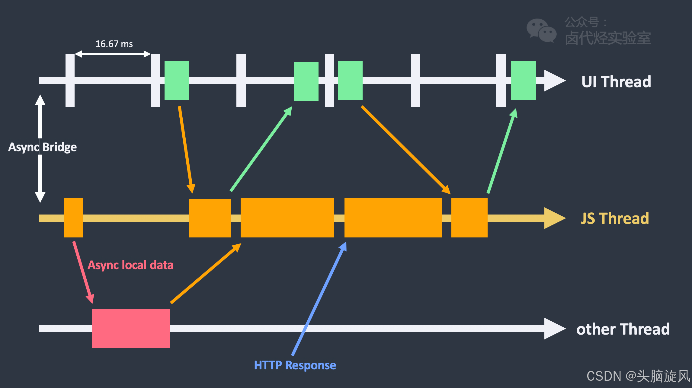
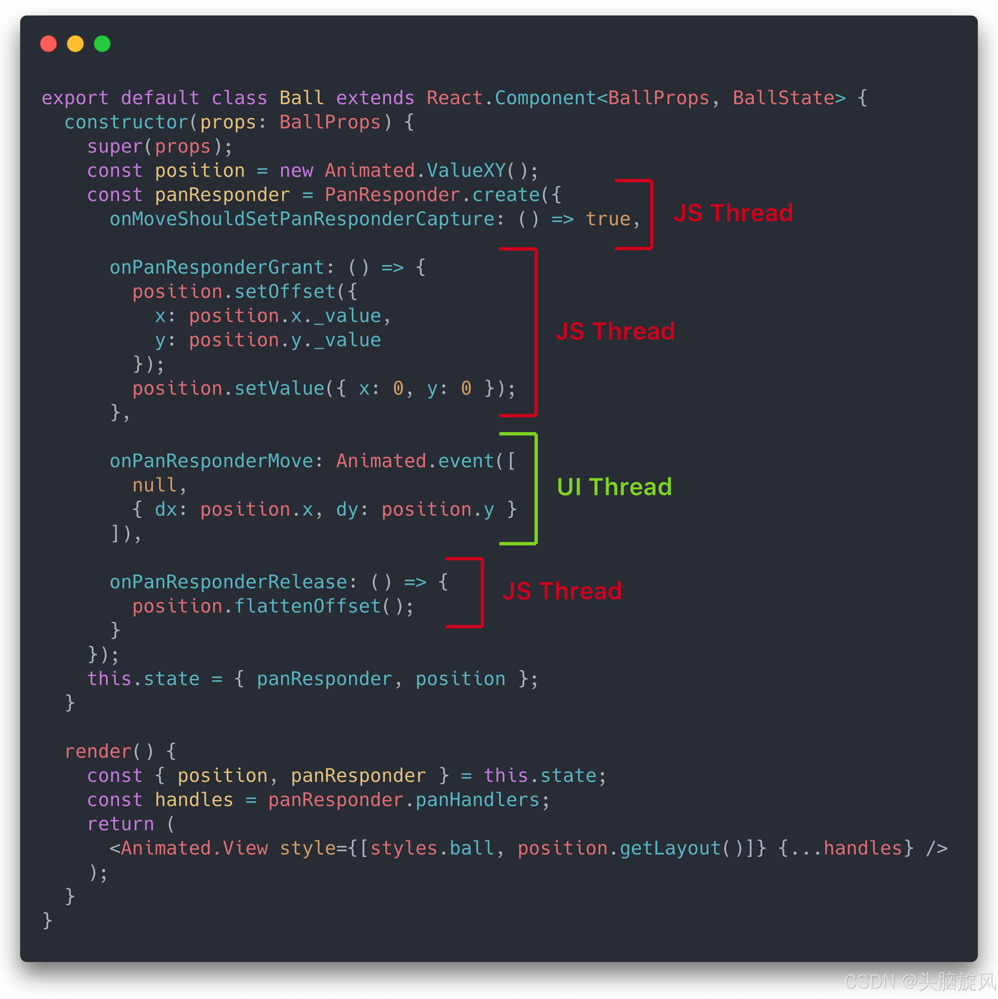
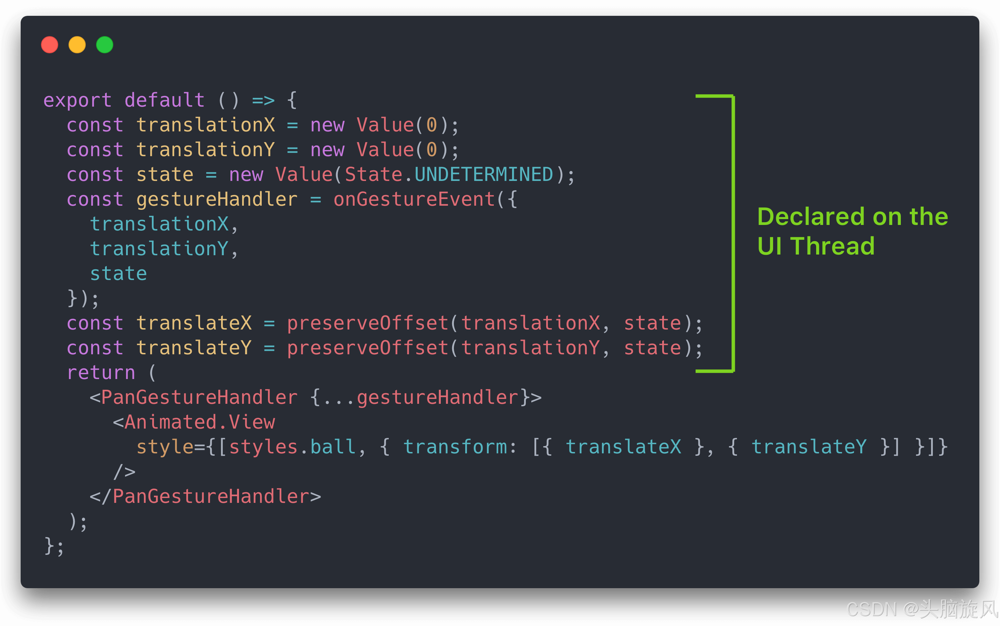
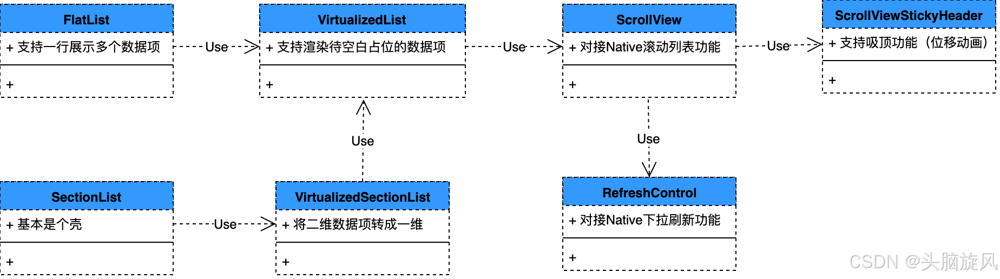
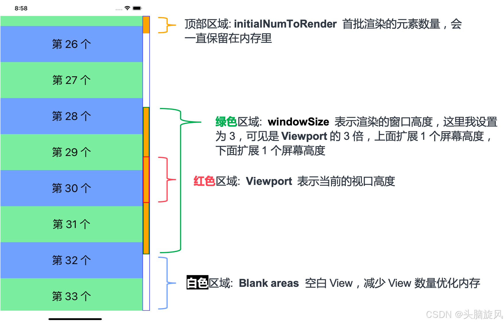
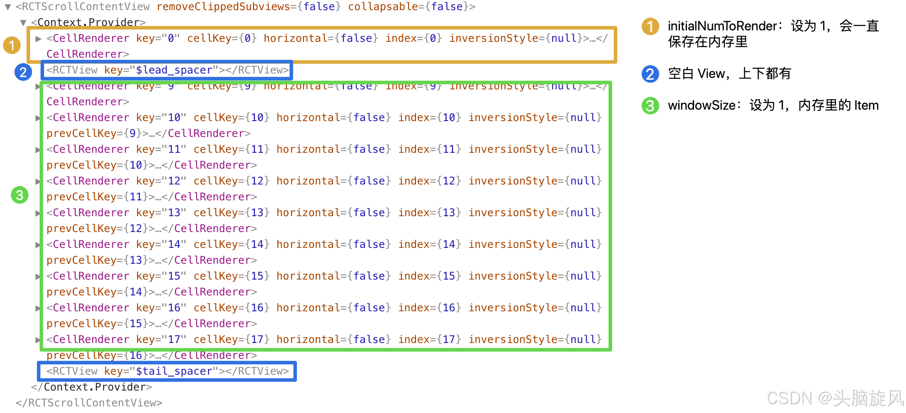

### React Native 是什么？

答案：React Native 是一个基于 React 构建的框架，允许使用 JavaScript 和 React 的编程方式来开发原生移动应用。


### React Native 与 React 有什么不同？

答案：React Native 允许开发者使用 React 的编程方式来开发原生应用，而不是 Web 应用。它使用原生组件而不是 Web 组件，并且可以访问设备的原生功能。


### React Native 的主要优势是什么？

答案：React Native 的主要优势包括能够使用一套代码库开发跨平台（iOS 和 Android）的应用、拥有接近原生应用的性能、热重载功能以及可以利用现有的 React 生态系统。


### 在 React Native 中如何进行组件化开发？

答案：在 React Native 中，你可以像在 React 一样进行组件化开发，使用 import 和 export 来导入和导出组件。


### React Native 中的 FlatList 和 SectionList 有什么区别？

答案：FlatList 是一个高性能的滚动列表组件，适用于长列表的展示；SectionList 在 FlatList 的基础上增加了分组（Section）的概念。


### React Native 中的导航是如何实现的？

答案：React Native 使用第三方库如 react-navigation 或 react-native-navigation 来实现应用内的导航。


### 在 React Native 中如何实现状态管理？

答案：React Native 可以使用 Redux、MobX 或 Context API 等状态管理方案来管理应用的状态。


### React Native 中的异步编程是如何实现的？

答案：React Native 中的异步编程可以通过回调函数、Promises、async/await 等方式实现。


### 在 React Native 中如何进行网络请求？

答案：在 React Native 中，可以使用 fetch API 或 axios 库来进行网络请求。


### React Native 支持热重载吗？

答案：是的，React Native 支持热重载，允许开发者在应用运行时动态加载新代码，无需重启应用。


### React Native 中的样式是如何应用的？

答案：React Native 中的样式可以直接在组件内联定义，也可以使用内联样式或导入 CSS 文件。


### 在 React Native 中如何使用第三方库？

答案：React Native 支持使用 npm 或 yarn 来安装第三方库，并且有大量的第三方库可供选择。


### React Native 中的触摸事件如何处理？

答案：React Native 提供了 PanResponder 来处理触摸事件，可以监听并响应一系列的触摸手势。


### 在 React Native 中如何实现动画？

答案：React Native 可以使用 Animated 库来实现动画效果，它提供了丰富的动画 API。


### React Native 应用的性能如何优化？

答案：性能优化的方法包括减少重渲染、合理使用 PureComponent 和 shouldComponentUpdate、使用原生模块等。


### React Native 支持哪些平台？

答案：React Native 主要支持 iOS 和 Android 平台，也可以通过特定的第三方库支持 Web 平台。


### 在 React Native 中如何调试应用？

答案：可以使用 Chrome DevTools 进行调试，也可以使用 React Native 的调试工具，如 React Native Debugger。


### React Native 中的 WebView 如何使用？

答案：React Native 提供了 WebView 组件，允许在原生应用中加载和显示 Web 页面。


### React Native 中的原生模块是什么？

答案：原生模块是使用原生语言（Objective-C 或 Java）编写的模块，可以被 JavaScript 代码调用，以访问设备的功能。


### React Native 的桥接机制是什么？

答案：React Native 的桥接机制是指 JavaScript 代码和原生代码之间的通信，它允许 JavaScript 发送任务给原生平台执行。

### React Native 的核心组件有哪些？

- View：一个支持布局和样式的容器。
- Text：用于显示文本。
- Image：用于显示图片。
- ScrollView：一个可以容纳多个组件和视图的滚动容器。
- FlatList：一个高效渲染大量数据列表的接口。


### React Native 中的生命周期方法有哪些？
React Native 遵循与 React 相同的生命周期方法。这些方法包括：

- 挂载：constructor()、componentDidMount()
- 更新：componentDidUpdate()、shouldComponentUpdate()
- 卸载：componentWillUnmount()

### 如何提高 React Native 应用的性能？

- 使用 FlatList 组件：高效渲染大列表。
- 优化图片：压缩图片并使用适当的图片格式。
- 减少重新渲染：使用 shouldComponentUpdate 或 React.memo 来防止不必要的重新渲染。
- 优化状态管理：最小化状态更新和重新渲染的次数。


### React Native 和 Flutter 最大的区别
Flutter 在自己的画布上渲染所有组件。

React Native 将 JavaScript 组件转换为原生组件。


### React Native 优化手段

#### 减少rerender
  shouldComponentUpdate
  React.memo
  React.pureComponent

```javascript
const MemoButton = React.memo(function Button(props) {
  return <button color={props.color} />;
});

class PureComponentButton extends React.PureComponent {
	render() {
		return <button color={this.props.color} />;
	}
}


```

#### 减轻渲染压力
  React.Fragment避免多层嵌套
  减少GPU过渡绘制
```javascript
// 以下示例 code 只保留了核心结构和样式，领会精神即可
render() {
  return (
    <View>
      <View style={{backgroundColor: 'white'}}>
        <View style={{backgroundColor: 'white'}}>
          <Text style={{backgroundColor: 'white'}}>Card1</Text>
        </View>
      </View>
      <View>
        <View>
          <Text>Card2</Text>
        </View>
      </View>
    </View>
  );
};

```
首先优化安卓:
- 减少背景色的重复设置：每个 View 都设置背景色的话，在 Android 上会造成非常严重的过度绘制；
  并且只有布局属性时，React Native 还会减少 Android 的布局嵌套
- 避免设置半透明颜色：半透明色区域 iOS Android 都会引起过度绘制
- 避免设置圆角：圆角部位 iOS Android 都会引起过度绘制
- 避免设置阴影：阴影区域 iOS Android 都会引起过度绘制

#### 图片优化

1. 图片类型
基础的 png/jpg/base64/gif 格式，支持良好。不过要注意的是，想要 Android 加载的 gif 图片动起来，要在 build.gradle 里面加一些依赖，具体内容可以看这个 链接。

如果要加载 webp 格式的图片，就有些问题了。作为 Google 推出的一种图片格式，Android 自然是支持的，但是 iOS 就不支持了，需要我们安装一些第三方插件。

2. 下载管理
先说结论，Image 组件对图片的下载管理能力基本为 0。

Image基本上只能监听单张图片的加载流程：onLoadStart/onLoad/onLoadEnd/onError，如果要控制多张图片的下载优先级，对不起，没有。

3. 缓存管理
缓存这里要从两方面说，一是通过 HTTP 头信息管理缓存，二是直接通过一些组件属性管理缓存。

Image 组件请求网络图片时，其实是可以加 HTTP header 头信息的，这样就可以利用 HTTP 缓存来管理图片，写法如下面代码所示：

```javascript
<Image
  source={{
  uri: 'https://facebook.github.io/react/logo-og.png',
  method: 'POST',
  headers: {
  Pragma: 'no-cache',
  },
  body: 'Your Body goes here',
  }}
  style={{width: 400, height: 400}}
/>
```
具体的控制参数可以参考 MDN HTTP 缓存，这里就不细说了。

直接通过属性控制图片缓存，iOS 有。Android？对不起，没有。

iOS 可以通过 source 参数里的 cache 字段控制缓存，属性也是非常常见的那几种：默认/不使用缓存/强缓存/只使用缓存。具体的使用可以看 iOS Image 缓存文档。

4. 多图加载
都快到 5G 时代了，短视频/VLog 大家都天天刷了，更不用说多图场景了，基本上已经是互联网应用的标配了。

- resizeMethod
  - resize 小容器加载大图的场景就应该用这个属性。原理是在图片解码之前，会用算法对其在内存中的数据进行修改，一般图片大小大概会缩减为原图的 1/8
  - scale 不改变图片字节大小，通过缩放来修改图片宽高。因为有硬件加速，所以加载速度会更快一些
  - auto 它只是单纯的判断图片路径，如果是本地图片，就会用 resize，其他都是 scale 属性，所以 http 图片都是 scale 的
  
Android 图片加载的时候，还会有一个 easy-in 的 300ms 加载动画效果，看上去会觉得图片加载变慢了，我们可以通过设置 fadeDuration 属性为 0，来关闭这个加载动画

- 优先使用32为色彩深度图片
```
R：红色，占据 8 bit
G：绿色，占据 8 bit
B：蓝色，占据 8 bit
A：透明通道，占据 8 bit
```
直接原因有 2 个：

- Android 推荐使用 ARGB_8888 格式的图片，因为这种图片显示效果更好
- iOS GPU 只支持加载 32 bit 的图片。如果是其他格式的（比如说 24 bit 的 jpg），
会先在 CPU 里转为 32 bit，再传给 GPU


- 保持 Image 和 ImageView 长宽一致。

  首先我们看看长宽不一致会引起的问题：

  - Image 小于 ImageView：图片不清晰，表情包电子包浆质感
  - Image 大于 ImageView：浪费内存，有可能会引起 OOM
  - 尺寸不一致会带来抗锯齿计算，增加了图形处理负担

- react-native-fast-image它的底层用的是 iOS 的 SDWebImage 和 Android 的 Glide

- 图片服务器辅助
  - 使用 WebP
    同样的视觉效果，图片体积会明显减少。而且可以显著减小 CodePush 热更新包的体积（热更新包里，图片占用 90% 以上的体积）。

  虽然 WebP 在前端解压耗时可能会多一点点，但是考虑到传输体积缩小会缩短网络下载时间，整体的收益还是不错的。

  - 图床定制图片
    指定图片宽高，控制图片质量。当然一些比较优秀的第三方对象存储也提供这些功能
  ```javascript
  https://www.imagescloud.com/image.jpg/0/w/100/h/100/q/80
  // w: 长为 100 px
  // h: 宽最多为 100 px
  // q: 压缩质量为 80
  
  
  ```

#### 对象创建调用分离
在 JS 引擎里，创建一个对象的时间差不多是调用一个已存在对象的 10 多倍
- 语法绑定回调函数
  ```javascript
    class Button extends React.Component {
      handleClick() {
        console.log('this is:', this);
      }
    
      render() {
        return <button onClick={(e) => this.handleClick(e)}>Click me</button>;
        // 这样的话一个函数只会创建一次，组件 re-render 时不会再次创建
        return <button onClick={this.handleClick}>Click me</button>;
      }
    }

  ```
- 语法绑定渲染函数
```javascript
render(){
  <FlatList
    data={items}
    renderItem={({ item }) => <Text>{item.title}</Text>}
  />
}

renderItem = ({ item }) => <Text>{item.title}</Text>;

render(){
	<FlatList
		data={items}
		renderItem={renderItem}
	/>
}


```

- StyleSheet.create 替代 StyleSheet.flatten
```javascript
// StyleSheet.create 这个函数，会把传入的 Object 转为优化后的 StyleID，
// 在内存占用和 Bridge 通信上会有些优化
const styles = StyleSheet.create({
  item: {
    color: 'white',
  },
});

console.log(styles.item) // 打印出的是一个整数 ID
// 问题就是使用这个方法时，会递归遍历已经转换为 StyleID 的样式对象，然后生成一个新的样式对象。
// 这样就会破坏 StyleSheet.create 之前的优化，可能会引起一定的性能负担
StyleSheet.flatten([styles.item, props.style]) // <= 合并默认样式和自定义样式
```

```
- 避免在 render 函数里创建新数组/对象
```javascript
render() {
  return <ListComponent listData={this.props.list || []}/>
}

// 更好的做法
const EMPTY_ARRAY = [];

render() {
	return <ListComponent listData={this.props.list || EMPTY_ARRAY}/>
}

```

#### 动画性能优化
- UI Thread：在 iOS/Android 上专门绘制 UI 的线程
- JS Thread：我们写的业务代码基本都在这个线程上，React 重绘，处理 HTTP 请求的结果，磁盘数据 IO 等等
- other Thread：泛指其他线程，比如说数据请求线程，磁盘 IO 线程等等


- useNativeDrive: true
  JS Thread 和 UI Thread 之间是通过 JSON 字符串传递消息的。对于一些可预测的动画，
  比如说点击一个点赞按钮，就跳出一个点赞动画，这种行为完全可以预测的动画，
  我们可以使用 useNativeDrive: true 开启原生动画驱动
```javascript
Animated.timing(this.state.animatedValue, {
  toValue: 1,
  duration: 500,
  useNativeDriver: true // <-- 加上这一行
}).start();

```
☆ **useNativeDriver 这个属性也有着局限性**，
只能使用到只有非布局相关的动画属性上，例如 transform 和 opacity。布局相关的属性，
比如说 height 和 position 相关的属性，开启后会报错。
而且前面也说了，useNativeDriver 只能用在可预测的动画上，
比如说跟随手势这种动画，useNativeDriver 就用不了的

- setNativeProps

- InteractionManager
```javascript
// 我们可以把一些繁重的任务放在 InteractionManager.runAfterInteractions()
InteractionManager.runAfterInteractions(() => {
  // ...需要长时间同步执行的任务...
});

// 在 React Native 官方提供的组件里，PanResponder、Animated，VirtualizedList
```

- 使用 react-native-reanimated 和 react-native-gesture-handler



#### 长列表优化
- 各种列表间的关系
  - ScrollView：会把视图里的所有 View 渲染，直接对接 Native 的滚动列表
  - VirtualizedList：虚拟列表核心文件，使用 ScrollView，长列表优化配置项主要是控制它
  - FlatList：使用 VirtualizedList，实现了一行多列的功能，大部分功能都是 VirtualizedList 提供的
  - SectionList：使用 VirtualizedList，底层使用 VirtualizedSectionList，把二维数据转为一维数据


- 列表配置项
```javascript
export default class App extends React.Component {
  renderItem = item => {
    return (
      <Text
        style={{
          backgroundColor: item.index % 2 === 0 ? 'green' : 'blue',
        }}>
        {'第 ' + (item.index + 1) + ' 个'}
      </Text>
    );
  }

  render() {
    let data = [];
    for (let i = 0; i < 1000; i++) {
      data.push({key: i});
    }

    return (
      <View style={{flex: 1}}>
        <FlatList
	  	  data={data}
          renderItem={this.renderItem}
          initialNumToRender={3} // 首批渲染的元素数量
          windowSize={3} // 渲染区域高度
          removeClippedSubviews={Platform.OS === 'android'} // 是否裁剪子视图
	  	  maxToRenderPerBatch={10} // 增量渲染最大数量
          updateCellsBatchingPeriod={50} // 增量渲染时间间隔
          debug // 开启 debug 模式
        />
      </View>
    );
  }
}

// VirtualizedList 有个 debug 的配置项，开启后会在视图右侧显示虚拟列表的显示情况。

// 这个属性文档中没有说，是翻源码发现的，我发现开启它后用来演示讲解还是很方便的，可以很直观的学习 initialNumToRender、windowSize、Viewport，Blank areas 等概念。

```

右侧 debug 指示条的黄色部分表示内存中 Item，各个属性我们再用文字描述一下
- initialNumToRender: 首批应该渲染的元素数量，刚刚盖住首屏最好。而且从 debug 指示条可以看出，这批元素会一直存在于内存中。

- Viewport: 视口高度，就是用户能看到内容，一般就是设备高度。

- windowSize:
渲染区域高度，一般为 Viewport 的整数倍。这里我设置为 3，从 debug 指示条可以看出，
- 它的高度是 Viewport 的 3 倍，上面扩展 1 个屏幕高度，下面扩展 1 个屏幕高度。在这个区域里的内容都会保存在内存里。

将 windowSize 设置为一个较小值，能有减小内存消耗并提高性能，但是快速滚动列表时，遇到未渲染的内容的几率会增大，
会看到占位的白色 View。大家可以把 windowSize 设为 1 测试一下，100% 会看到占位 View。

- Blank areas:
空白 View，VirtualizedList 会把渲染区域外的 Item 替换为一个空白 View，用来减少长列表的内存占用。顶部和底部都可以有。

上图是渲染图，我们可以利用 react-devtools 再看看 React 的 Virtual DOM（为了截屏方便，我把 initialNumToRender 和 windowSize 设为 1），
可以看出和上面的示意图是一致的。


- removeClippedSubviews:
这个翻译过来叫「裁剪子视图」的属性，文档描述不是很清晰，大意是设为 true 可以提高渲染速度，
- 但是 iOS 上可能会出现 bug。这个属性 VirtualizedList 没有做任何优化，是直接透传给 ScrollView 的。

在 0.59 版本的一次 commit 里，FlatList 默认 Android 开启此功能，如果你的版本低于 0.59，
可以用以下方式开启：removeClippedSubviews={Platform.OS === 'android'}

- maxToRenderPerBatch 和 updateCellsBatchingPeriod:
VirtualizedList 的数据不是一下子全部渲染的，而是分批次渲染的。这两个属性就是控制增量渲染的。

这两个属性一般是配合着用的，maxToRenderPerBatch 表示每次增量渲染的最大数量，updateCellsBatchingPeriod 表示每次增量渲染的时间间隔。

我们可以调节这两个参数来平衡渲染速度和响应速度。但是，调参作为一门玄学，很难得出一个统一的「最佳实践」，
所以我们在业务中也没有动过这两个属性，直接用的系统默认值。


- ListLtems 优化

1. 使用 getItemLayout:
  如果 FlatList（VirtualizedList）的 ListLtem 高度是固定的，那么使用 getItemLayout 就非常的合算。

   如果不使用 getItemLayout，那么所有的 Cell 的高度，
   都要调用 View 的 onLayout 动态计算高度，这个运算是需要消耗时间的；
   如果我们使用了 getItemLayout，VirtualizedList 就直接知道了 Cell 的高度和偏移量，
   省去了计算，节省了这部分的开销。

   在这里我还想提一下几个注意点，希望大家使用 getItemLayout 要多注意一下：

   - 1. 如果 ListItem 高度不固定，使用 getItemLayout 返回固定高度时，因为最终渲染高度和预测高度不一致，会出现页面跳动的问题【 问题链接】
   - 2. 如果使用了 ItemSeparatorComponent，分隔线的尺寸也要考虑到 offset 的计算中【 文档链接】
   - 3. 如果 FlatList 使用的时候使用了 ListHeaderComponent，也要把 Header 的尺寸考虑到 offset 的计算中【 官方示例代码链接】
2. Use simple components & Use light components: 使用简单组件，核心就是减少逻辑判断和嵌套，优化方式可以参考「二、减轻渲染压力」的内容。
3. Use shouldComponentUpdate: 参考「一、re-render」的内容。
4. Use cached optimized images: 参考「三、图片优化那些事」的内容。
5. Use keyExtractor or key: 常规优化点了，可以看 React 的文档 列表 & Key。
6. Avoid anonymous function on renderItem: renderItem 避免使用匿名函数，参考「四、对象创建调用分离」的内容。


#### 性能优化用到的工具
xcode instruments Profiler
react-devtools
iOS Simulator
Android 真机 -> 开发者选项
