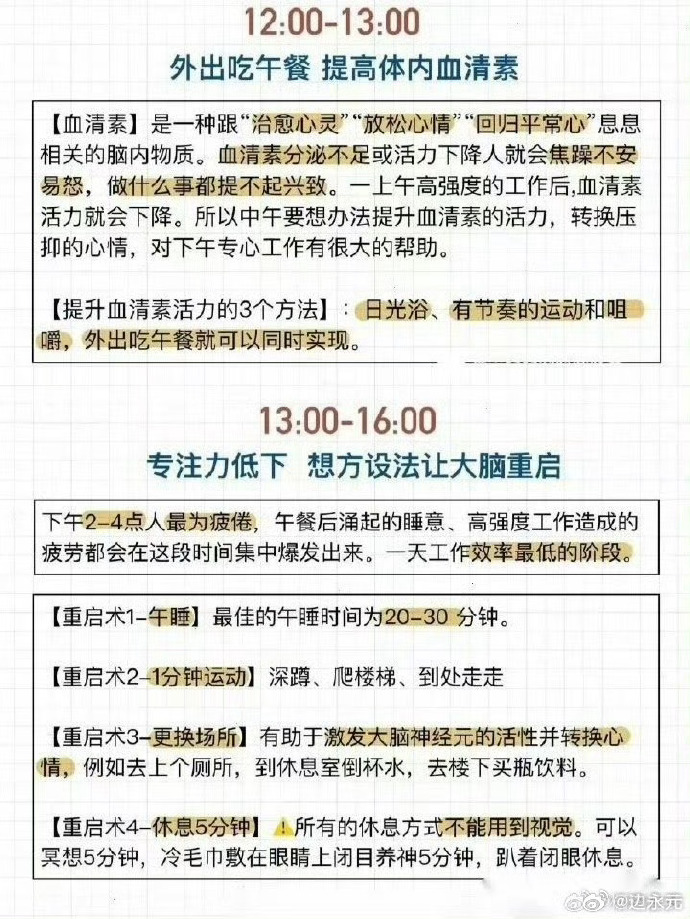

# 自律
### 时间管理

### 背书法
- 3x3背书法
  - 先读3遍, 把重点和关键词圈出来,或直接卸载纸上
  - 再读3遍,过程中出现卡壳,瞄一眼教材
  - 最后3遍,一遍背一遍写, 第3遍时候必须完整写下来
- 早起复习+晚上睡前
  - 睡前一小时回顾当天所学内容
  - 第二天早起脑海再过一遍知识点,边背边写记不清的内容,着重背这部分,反复几次就能彻底记住

### 生活规律

### 成长书单

# 育儿

### 暗示的力量太强大，有些话永远不要对孩子说

### 养一个阳光明媚的女儿，请经常对她说这些

### 7件核心大事

### 不要在小事上消耗孩子
1. 允许孩子犯错
2. 不让坏情绪影响孩子
3. 不用言语打击孩子
4. 给予孩子充分的自主权和选择权
