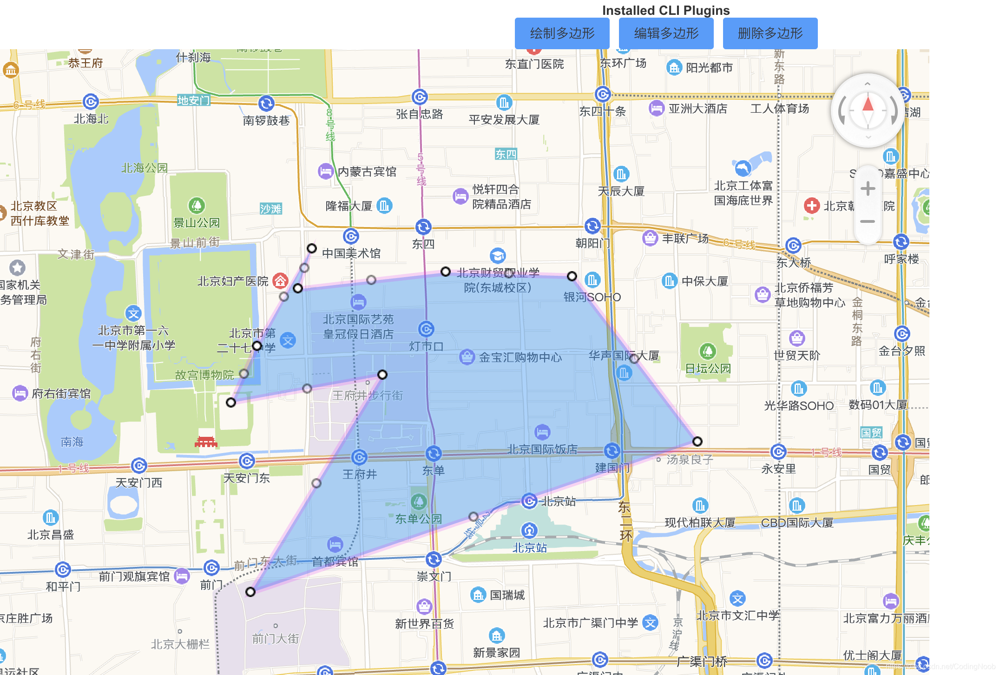

```vue
<template>
  <div class="index">
    <el-button type="primary" @click="drawRectangle">绘制多边形</el-button>
    <el-button type="primary" @click="editRectangle">编辑多边形</el-button>
    <el-button type="primary" @click="deleRectangle">删除多边形</el-button>
    <div id="amapContainer"></div>
  </div>
</template>
 
<script>
export default {
  name: 'amapFence',
  data () {
    return {
      path: [], // 当前绘制的多边形经纬度数组
      polygonItem: [], // 地图上绘制的所有多边形对象
      polyEditors: []  // 所有编辑对象数组
    }
  },
  props: {
    paths: {} // 编辑
  },
  mounted () {
    this.intAmap(() => {
      if (this.paths) {
        this.editRectangle(this.paths);
      }
    });
  },
  methods: {
    // 地图初始化
    intAmap (callBack) {
      this.AMap = window.AMap;
      this.AMap.plugin(['AMap.MouseTool', 'AMap.PolyEditor', 'AMap.ControlBar'], function () {
        //TODO  创建控件并添加
      });
      this.map = new this.AMap.Map("amapContainer", {
        center: [116.434381, 39.898515],
        zoom: 14,
        mapStyle: "amap://styles/darkblue",
        pitch: 80,
        rotation: -15,
        viewMode: '3D',//开启3D视图,默认为关闭
        buildingAnimation: true,//楼块出现是否带动画
      });
      this.map.addControl(new this.AMap.ControlBar());
      if (callBack && typeof callBack == 'function') {
        callBack();
      }
    },
    // 编辑围栏
    editRectangle (paths) {
      const path = paths;
      const AMap = window.AMap;
      var polygon = new this.AMap.Polygon({
        path: path,
        strokeColor: "#FF33FF",
        strokeWeight: 6,
        strokeOpacity: 0.2,
        fillOpacity: 0.4,
        fillColor: '#1791fc',
        zIndex: 50,
      });
 
      this.map.add(polygon);
      this.polygonItem.push(polygon);
      // 缩放地图到合适的视野级别
      this.map.setFitView([polygon]);
 
      this.polyEditor = new AMap.PolyEditor(this.map, polygon);
      this.polyEditor.open();
      this.polyEditors.push(this.polyEditor);
 
      this.polyEditor.on('addnode', function (event) {
        console.info('触发事件：addnode', event)
        console.info('修改后的经纬度：', polygon.getPath())
      });
 
      this.polyEditor.on('adjust', function (event) {
        console.info('触发事件：adjust', event)
        console.info('修改后的经纬度：', polygon.getPath())
      });
 
      this.polyEditor.on('removenode', function (event) {
        console.info('触发事件：removenode', event)
        console.info('修改后的经纬度：', polygon.getPath())
      });
 
      this.polyEditor.on('end', function (event) {
        console.info('触发事件： end', event)
        console.info('修改后的经纬度：', polygon.getPath())
        // event.target 即为编辑后的多边形对象
      });
    },
    // 绘制多边形
    drawRectangle () {
      const vm = this;
      this.mouseTool = new this.AMap.MouseTool(this.map);
      const polygon = this.mouseTool.polygon({
        strokeColor: 'red',
        strokeOpacity: 0.5,
        strokeWeight: 6,
        fillColor: 'blue',
        fillOpacity: 0.5,
        // strokeStyle还支持 solid
        strokeStyle: 'solid',
        // strokeDasharray: [30,10],
      });
 
      this.mouseTool.on('draw', function (event) {
        // event.obj 为绘制出来的覆盖物对象
        var polygonItem = event.obj;
        var paths = polygonItem.getPath();//取得绘制的多边形的每一个点坐标
        console.log('覆盖物对象绘制完成各个点的坐标', paths);
        var path = [];  // 编辑的路径
        paths.forEach(v => {
          path.push([v.lng, v.lat])
        });
        vm.path = path;
        vm.editRectangle(vm.path);
        vm.polygonItem.push(event.obj);
        vm.map.remove(event.obj); // 删除多边形
        console.log(polygon, '------polygon-----');
      });
    },
    // 批量删除多边形
    deleRectangle () {
      // 取消编辑状态
      this.polyEditors.forEach(v => {
        v.close();
      });
      this.map.clearMap(); // 删除地图所有覆盖物
    },
  }
}
</script>
 
<style lang="scss" scoped>
#amapContainer {
  height: 800px;
  width: 1000px;
}
</style>
```
