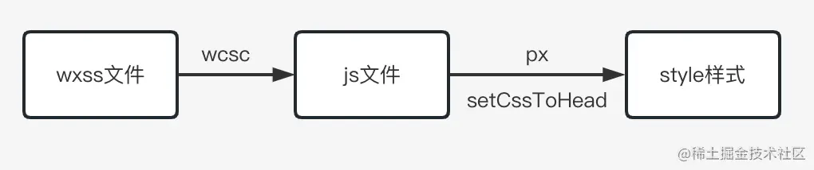

## 原理

     WXML 模板和 WXSS 样式工作在渲染层， 渲染层的界面使用了 WebView 进行渲染；
     JS 脚本工作在逻辑层     逻辑层采用 JsCore 线程运行 JS 脚本

     
     两个线程:  渲染层 逻辑层  
    通过Native转发

    优缺点:

    相对于浏览器双线程模型
    1. 更加安全，因为微信小程序阻止开发者使用一些浏览器提供的一些功能，如操作DOM、动态执行脚本等
    2. 不用等待浏览器主线程去下载并解析 html，遇到 JS 脚本还会阻塞，影响视图渲染，造成白屏
    3. 缺点是双线程如果频繁的通信，操作 setDate 更新视图，对性能消耗特别严重，例如拖拽、滚动等


    View 层进行事件操作后，会通过 WeixinJSBridge 将数据传递到 Native 系统层。Native 
    系统层决定是否要用 native 处理，然后丢给逻辑层进行用户的逻辑代码处理。
    逻辑层处理后将数据通过 WeixinJSBridge 返给 View 层

    <webview partition="persist:simulator_1"></webview>
    <webview partition="persist:apservice_1"></webview>

    wcc 编译器负责将 wxml 编译成 js 文件
    wcsc 编译器负责将 wxss 文件编译成 js 文件
    xxx.wxvpkg 是不同版本的小程序基础库，主要包含小程序基础库 WAService 和 WAWebview，

    wcc的作用就是：

        执行 wcc 编译 wxml 生成相关页面注册代码，并记录标签的属性及其值（生成 JS 文件）
        这个文件主体是一个 $gwx() 函数，接收两个参数 path （页面 wxml 路径）和 global（顶层对象)

        wcsc 编译 wxss 得到一个 js 文件
        添加尺寸单位rpx转换，可根据屏幕宽度自适应
        提供 setCssToHead 方法将转换后的 css 内容添加到 header

        WAWebview：小程序视图层基础库，提供视图层基础能力
        WAService：小程序逻辑层基础库，提供逻辑层基础能力

        其中，WAWebview 最主要的几个部分：

            Foundation：基础模块(发布订阅、通信桥梁 ready 事件)
            WeixinJSBridge：消息通信模块（js 和 native 通讯） Webview 和 Service都有相同的一套
            exparser：组件系统模块，实现了一套自定义的组件模型，比如实现了 wx-view
            __virtualDOM__：虚拟 Dom 模块
            __webViewSDK__：WebView SDK 模块
            Reporter：日志上报模块(异常和性能统计数据)

        其中，WAService 最主要的几个部分：

            Foundation：基础模块
            WeixinJSBridge：消息通信模块(js 和 native 通讯) Webview 和 Service都有相同的一套
            WeixinNativeBuffer：原生缓冲区
            WeixinWorker：Worker 线程
            JSContext：JS Engine Context
            Protect：JS 保护的对象
            __subContextEngine__：提供 App、Page、Component、Behavior、getApp、getCurrentPages 等方法


### 做了哪些优化
生命周期
应用的生命周期(onLaunch onShow onHide onError onPageNotFound onThemeChange onUnhandledRejection)
页面生命周期 (onLoad onShow onReady onHide onUnload)
组件生命周期 (created attached ready moved detached error)

1. 独立分包 主包 分包A ...
2. 压缩 减小代码包大小
    图片加载
    // in app.wxs 利用阿里云oss提供的服务转换图片格式
    var wrapUrl = function (url) {
      var fConfig = '?x-oss-process=image/format,webp'
      return url + fConfig
    }
3. 清理无用资源代码
4. 按需注入 用时注入
    app.json中设置 "lazyCodeLoading": "requiredComponents"
5. 缓存数据
骨架屏
接口请求放到页面的生命周期 onLoad 中，而不是 onReady里
避免不当使用setData, 尽可能合并
避免在 onPageScroll 回调中多次调用 setData
减少或避免在 onHide/onUnload 中执行耗时逻辑，如同步接口调用、setData 


### rpx单位如何计算的

rpx单位是微信小程序中css的尺寸单位，rpx可以根据屏幕宽度进行自适应。

    规定屏幕宽为750rpx。如在 iPhone6 上，屏幕宽度为375px，共有750个物理像素，
    则750rpx = 375px = 750物理像素，1rpx = 0.5px

    设备 rpx换算px (屏幕宽度/750) px换算rpx (750/屏幕宽度)
    iPhone5 1rpx = 0.42px 　　 1px = 2.34px
    iPhone6 1rpx = 0.5px 　　　　1px = 2rpx
    iPhone6s 1rpx = 0.552px 　　 1px = 1.81rpx

    微信小程序也支持rem尺寸单位，rem和rpx的换算关系：rem: 规定屏幕宽度为20rem；1rem = (750/20)rpx 。


### uni-app 踩坑

全屏组件 添加view 设置 vh vw 包裹
wx.onNetworkStatusChange、uni.onNetworkStatusChange网络状态监听不生效问题
1、该方法只能在手机上进行验证才能生效，小程序开发工具上面不生效
2、该方法只能写在onLoad方法里面，写在mounted方法不生效

ios 底部区域是position:fixed, margin-bottom失效

微信小程序button通过数组的length判断disabled无效（数组length === 0写法无效）

IOS苹果手机上时间格式化错误显示Invalid Date   '-'

px和rpx相加计算不准确问题（吸顶效果的实现在不同机型存在间隙误差问题）

top: `calc(${statusBarHeight}px + 92rpx)` }"
text-align:end 改成 text-align: right
uni-easyinput组件，例如模拟器上设置光标颜色为蓝色可以生效,
caret-color: #51b3ff; // 设置光标颜色  

textarea 代替

    Promise.allSettled()方法在部分IOS机型上无效

    h5 发送消息到webview
        先用官方api中的wx.miniProgram.navigateTo()方法，
        从A页面中的H5页面（命名为a）打开第二个页面B，然后在B页面通过const pages = getCurrentPages()方法来拿到A页面的实例，
        从而调用A页面中的方法，同时关闭页面B

    image组件使用webp图片时，IOS需要设置webp属性

    小程序中使用 web-view打开pdf , IOS 可以正常打开，Android 打开为空白
        wx.downloadFile和wx.openDocument

    url传参 encodeURIComponent()  decodeURIComponent()

    canvas 不能使用 rpx  wx.getSystemInfo这个api来获取到运行手机的屏幕的宽度和高度

### 对比h5优势

1. 开发方式
h5 可以用任何框架
开发一个微信小程序，由于微信团队提供了开发者工具，以及api,并且规范了开发标准。在使用这些API时，不用考虑浏览器兼容性，不用担心出现BUG
获取权限不同
小程序依赖微信客户端,方便调用端上api,
比如网络通信状态、数据缓存能力等，这些系统级权限都可以和微信小程序无缝衔接。 这也是H5的大多应用场景被定位在业务逻辑简单、功能单一的原因。
2. 呈现方式
H5：就是网页，主要在网页为依托，靠浏览器来呈现内容的，并且可以以微信为转接，通过链接跳转来使用。
小程序：小程序与H5的主要区别就在于小程序需要和微信绑定，不能独立的存在。好处也在可以与微信一键绑定微信用户的手机号。
3. 分享方式
H5:在分享方式上H5有着一些优势，它可以通过朋友圈来分享。可以是链接、海报、甚至是GIF来展现。形式更多种多样让人多种类的来选择。
小程序：而小程序就简便很多了，需要靠图片、文字加上小程序分享码来呈现的，方式上就比较单一了。
4. 打开方式
H5:在打开方便H5也占着一定的优势，H5可以借助微信的扫码或者直接点击链接就可以随时随地的打开。
小程序:小程序在这里就需要先打开微信为基地，无论怎么使用都无法离开微信的。但是这也更直接的筛选面对的用户群体。

### wxml


### wxss


### rpx转成px

有个transformRPX方法，进行rpx转px，实际上就是rpx值 / 基础宽度750 * 设备宽度

## 微信扫码登录原理

    用户打开网站的登录首页的时候，浏览器就会向对应网页服务器发送获取登录二维码的请求，服务器收到请求后，
    会随机生成一个 uuid，将这个 uuid 作为key值存入redis服务器，同时设置一个过期时间，
    一旦过期后，用户登录二维码需要进行刷新重新获取。

    将这个key值和公司的验证字符串合在一起，通过二维码生成接口，生成一个二维码的图片。然后，将二维码图片和 uuid 一起返回给用户浏览器

    由于手机端已经进行过了登录，在访问手机端的服务器的时候，参数中都会携带一个用户的token，
    手机端服务器可以从中解析到用户的 userId（这里从token中取值而不是手机端直接传userid是为了安全
    
    当用户打开网站后，网站后台根据微信 OAuth2.0 协议向微信开发平台请求授权登录，并传递事先在微信开发平台中审核通过的 AppID 和 AppSecrect 等参数
    微信开发平台对AppID等参数进行验证，并向网站后台返回二维码
    网站后台将二维码传送至网站前端进行显示


    服务器拿到 uuId 和 userId 后，将用户的userid作为value值存入redis中以uuid作为key的键值对中。

    网站后台接收到code，表明微信开发平台同意数据请求
    网站后台根据code参数，再加上AppID和AppSecret请求微信开发平台换取 access_token
    微信开发平台验证参数，并返回 access_token
    网站后台收到 access_token 后即可进行参数分析获得用户账号数据

    
    AppID：应用唯一标识，在微信开放平台提交应用审核通过后获得
    AppSecret：应用密钥，在微信开放平台提交应用审核通过后获得
    code：授权临时票据，第三方通过code进行获取access_token的时候需要用到，code的超时时间为10分钟，一个code只能成功换取一次access_token 即失效。code的临时性和一次性保障了微信授权登录的安全性。
    access_token：用户授权第三方应用发起接口调用的凭证

    整个过程从网站后台向微信开发平台请求授权登录开始，最终目的是为了获得 access_token。


## 开发遇到的问题
https://juejin.cn/post/7034435052817776676?utm_source=gold_browser_extension
https://juejin.cn/post/6961317489225498631

#### 真机MiniProgramError报错
wx.showLoading 和 wx.showToast 同时只能显示一个

```javascript
// 定义一个变量 isShowLoading = false；
// 调用 wx.showLoading 时候赋值 isShowLoading 为true，并调用showLoading

     if(!isShowLoading){
        wx.showLoading({
          title: '加载中',
          icon: 'loading',
        })
        isShowLoading =true;
      }
//调用 wx.hideLoading 时候先判断 isShowloading，为true才能执行，否则不执行。
    if(isShowLoading){
      wx.hideLoading()
      isShowLoading =false;
    }
//调用 wx.showToast 时候判断 isShowloading，为true就执行 wx.hideLoading ，
//否则不执行。接着执行showToast函数。
      if(this.data.isShowLoading){
        wx.hideLoading()
      }
      wx.showToast({ 
        title: '没有更多数据了',
        icon: 'none',
      });

```

#### 当设置swiper圆角时，会出现先直角后圆角
```text
解决方式：
1. 需要在swiper外面的盒子设置  overflow: hidden;
2. 在swiper上设置
    ovewflow:hidden;
    border-radius:10rpx;
    transform: translateY(0);
3. 给图片设置圆角
    border-radius:10rpx;
```

#### scroll-view横向滑动存在拉动条问题
```css
 /* 在父盒子中加上 */
::-webkit-scrollbar {
      width: 0;
      height: 0;
      color: transparent;
  }

```

#### 根据导航栏与胶囊计算主体导航栏高度
```javascript
//index.js
let systemInfo = wx.getSystemInfoSync();
let rect = wx.getMenuButtonBoundingClientRect
  ? wx.getMenuButtonBoundingClientRect()
  : null; //胶囊按钮位置信息

wx.getMenuButtonBoundingClientRect();

let navBarHeight = (function () {
  //导航栏高度
  let gap = rect.top - systemInfo.statusBarHeight; //动态计算每台手机状态栏到胶囊按钮间距
  return 2 * gap + rect.height;
})();

this.setData({ navBarHeight });

```

#### 兼容性问题
1. IOS 的 Date 构造函数 不支持2018-04-26这种格式的日期，必须转换为2018/04/26这种格式，可以使用 dayjs 处理
2. image组件使用webp图片时，IOS需要设置webp属性
3. Android手机在onShow内调用 wx.showModal ，如果不关闭弹窗（直接点击右上角退出小程序），弹窗不会销毁，再次进入页面触发onShow时会出现两次弹窗，IOS正常
4. IOS 内 page-container 内嵌套 van-popup 类弹出层容器，会出现弹出层 z-index失效 问题，
  可以根据弹出层显示隐藏动态更改page-container 的 custom-style 设置 -webkit-overflow-scrolling属性
5. 小程序中使用 web-view打开pdf , IOS 可以正常打开，Android 打开为空白

```javascript
// 使用wx.downloadFile 和 wx.openDocument
wx.downloadFile({
  url: 'https://.../XXX.pdf', //要预览的 PDF 的地址
  success: function (res) {
    if (res.statusCode === 200) { //成功
      var Path = res.tempFilePath //返回的文件临时地址，用于后面打开本地预览所用
      wx.openDocument({
        fileType: 'pdf', // 文件类型
        filePath: Path, //要打开的文件路径
        success: function (res) {
          console.log('打开 PDF 成功');
        }
      })
    }
  },
  fail: function (err) {
    console.log(err); //失败
  }
})

```


## 性能优化

1. 分包和预加载, 配置preloadRule
2. 代码注入优化 { lazyCodeLoading: requiredComponents }。 减少同步api调用getSystemInfoSync/避免复杂运算
3. 图片渲染优化 lazy-load
4. 首屏优化:
    精简首屏数据
    提前获取数据Page.onLoad
    缓存首屏数据
    骨架屏
5. 合理使用setData
