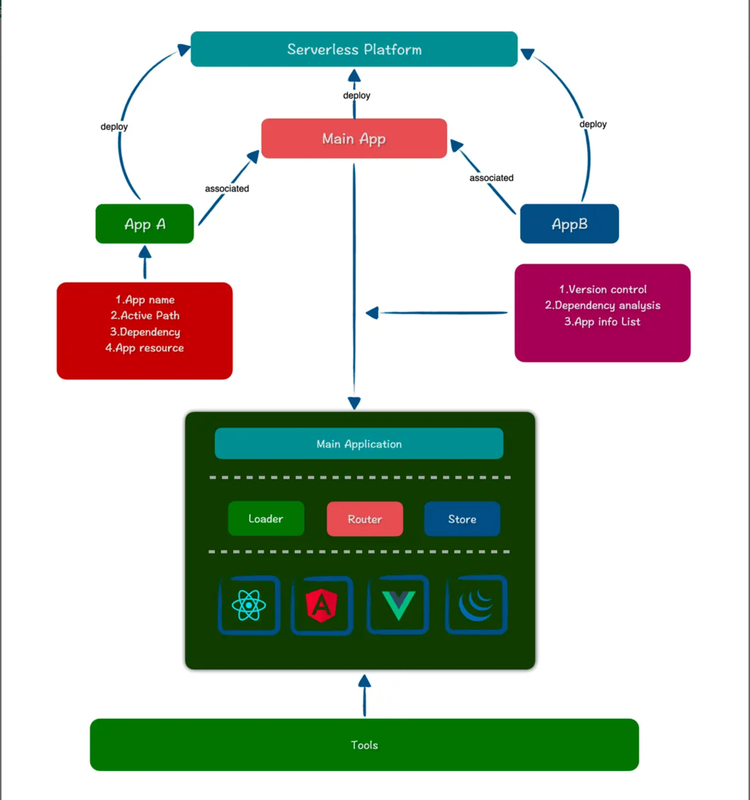

[浅析微前端沙箱](https://segmentfault.com/a/1190000044225816)

[从0实现微前端](https://juejin.cn/post/7047701758985895972)



## iframe

最大的特性就是提供了浏览器原生的硬隔离方案，不论是样式隔离、js 隔离这类问题统统都能被完美解决。
但他的最大问题也在于他的隔离性无法被突破，
导致应用间上下文无法被共享，随之带来的开发体验、产品体验的问题

存在的问题:
- url 不同步。浏览器刷新 iframe url 状态丢失、后退前进按钮无法使用。
- UI 不同步，DOM 结构不共享。想象一下屏幕右下角 1/4 的 iframe 里来一个带遮罩层的弹框，同时我们要求这个弹框要浏览器居中显示，还要浏览器 resize 时自动居中..
- 全局上下文完全隔离，内存变量不共享。iframe 内外系统的通信、数据同步等需求，主应用的 cookie 要透传到根域名都不同的子应用中实现免登效果。
- 慢。每次子应用进入都是一次浏览器上下文重建、资源重新加载的过程。

## 基于代理Proxy的沙箱
```javascript
const varBox = {};
const fakeWindow = new Proxy(window, {
  get(target, key) {
    return varBox[key] || window[key];
  },
  set(target, key, value) {
    varBox[key] = value;
    return true;
  },
});

window.test = 1;
```

```javascript
// 修改全局对象 window 方法
const setWindowProp = (prop, value, isDel) => {
    if (value === undefined || isDel) {
        delete window[prop];
				return
    }
		window[prop] = value;
}

class Sandbox {
    name;
    proxy = null;

    // 沙箱期间新增的全局变量
    addedPropsMap = new Map();

    // 沙箱期间更新的全局变量
    modifiedPropsOriginalValueMap = new Map();

    // 持续记录更新的(新增和修改的)全局变量的 map，用于在任意时刻做沙箱激活
    currentUpdatedPropsValueMap = new Map();

    constructor(name) {
      this.name = name;
      const fakeWindow = Object.create(null); // 创建一个原型为 null 的空对象
      const { addedPropsMap, modifiedPropsOriginalValueMap, currentUpdatedPropsValueMap } = this;

			this.proxy = new Proxy(fakeWindow, {
        set(_, prop, value) {
          if(!window.hasOwnProperty(prop)) {
            // 如果 window 上没有的属性，记录到新增属性里
            addedPropsMap.set(prop, value);
          } else {
						// 如果当前 window 对象有该属性，且未更新过，则记录该属性在 window 上的初始值
						if (!modifiedPropsOriginalValueMap.has(prop)) {
							const originalValue = window[prop];
							// 记录一下windows上存在的属性原始值
							modifiedPropsOriginalValueMap.set(prop, originalValue);
						}
          }
  
          // 记录修改属性以及修改后的值
          currentUpdatedPropsValueMap.set(prop, value);
  
          // 设置值到全局 window 上
          setWindowProp(prop, value);
          console.log('window.prop', window[prop]);
  
          return true;
        },
        get(target, prop) {
          return window[prop];
        },
      });
    }
    
    // 应用沙箱被激活
    active() {
        // 根据之前修改的记录重新修改 window 的属性，即还原沙箱之前的状态
        this.currentUpdatedPropsValueMap.forEach((v, p) => setWindowProp(p, v));
    }

    // 应用沙箱被卸载
    inactive() {
        // 1 将沙箱期间修改的属性还原为原先的属性
        this.modifiedPropsOriginalValueMap.forEach((v, p) => setWindowProp(p, v));
        // 2 将沙箱期间新增的全局变量消除
        this.addedPropsMap.forEach((_, p) => setWindowProp(p, undefined, true));
    }

}

// 初始化一个沙箱
const newSandBox = new Sandbox('app1');
const proxyWindow = newSandBox.proxy;
proxyWindow.test = 1;
console.log(window.test, proxyWindow.test) // 1 1;

// 关闭沙箱
newSandBox.inactive();
console.log(window.test, proxyWindow.test); // undefined undefined;

// 重启沙箱
newSandBox.active();
console.log(window.test, proxyWindow.test) // 1 1 ;
```

#### 多实例
```javascript
class Sandbox {
    name;
    constructor(name, context = {}) {
        this.name = name;
        const fakeWindow = Object.create({});

        return new Proxy(fakeWindow, {
            set(target, name, value) {
                if (Object.keys(context).includes(name)) {
                    context[name] = value;
                }
                target[name] = value;
            },
            get(target, name) {
                // 优先使用共享对象
                if (Object.keys(context).includes(name)) {
                    return context[name];
                }
                if (typeof target[name] === 'function' && /^[a-z]/.test(name)) {
                    return target[name].bind && target[name].bind(target);
                } else {
                    return target[name];
                }
            }
        });
    }
	active() {
		// 缓存active状态的沙箱
		this.windowSnapshot = {};
		for (const item in window) {
			this.windowSnapshot[item] = window[item];
		}

		Object.keys(this.modifyMap).forEach(p => {
			window[p] = this.modifyMap[p];
		})
	}
	inactive() {
		for (const item in window) {
			if (this.windowSnapshot[item] !== window[item]) {
				// 记录变更
				this.modifyMap[item] = window[item];
				// 还原window
				window[item] = this.windowSnapshot[item];
			}
		}
	}
    //  ...
}

/**
 * 注意这里的 context 十分关键，因为我们的 fakeWindow 是一个空对象，window 上的属性都没有，
 * 实际项目中这里的 context 应该包含大量的 window 属性，
 */

// 初始化2个沙箱，共享 doucment 与一个全局变量
const context = { document: window.document, globalData: 'abc' };

const newSandBox1 = new Sandbox('app1', context);
const newSandBox2 = new Sandbox('app2', context);

newSandBox1.test = 1;
newSandBox2.test = 2;
window.test = 3;

/**
 * 每个环境的私有属性是隔离的
 */
console.log(newSandBox1.test, newSandBox2.test, window.test); // 1 2 3;

/**
 * 共享属性是沙盒共享的，这里 newSandBox2 环境中的 globalData 也被改变了
 */
newSandBox1.globalData = '123';
console.log(newSandBox1.globalData, newSandBox2.globalData); // 123 123;
```


### 基于iframe沙箱

```javascript
const iframe = document.createElement('iframe', { url: 'about:blank' });

const sandboxGlobal = iframe.contentWindow;
sandbox(sandboxGlobal);


class SandboxWindow {
    constructor(options, context, frameWindow) {
        return new Proxy(frameWindow, {
            set(target, name, value) {
                if(Object.keys(context).includes(name)) {
                    context[name] = value;
                }
                target[name] = value;
            },
            get(target, name) {
                // 优先使用共享对象
                if(Object.keys(context).includes(name)) {
                    return context[name];
                }

                if(typeof target[name] === 'function' && /^[a-z]/.test(name)) {
                    return target[name].bind && target[name].bind(target);
                } else {
                    return target[name];
                }
            }
        });
    }
    //  ...
}

const iframe = document.createElement('iframe', { url: 'about:blank' });
document.body.appendChild(iframe);
const sandboxGlobal = iframe.contentWindow;
// 需要全局共享的变量
const context = { document: window.document, history: window.histroy };
const newSandBoxWindow = new SandboxWindow({}, context, sandboxGlobal);
// newSandBoxWindow.history 全局对象
// newSandBoxWindow.abc 为 'abc' 沙箱环境全局变量
// window.abc 为 undefined
```
