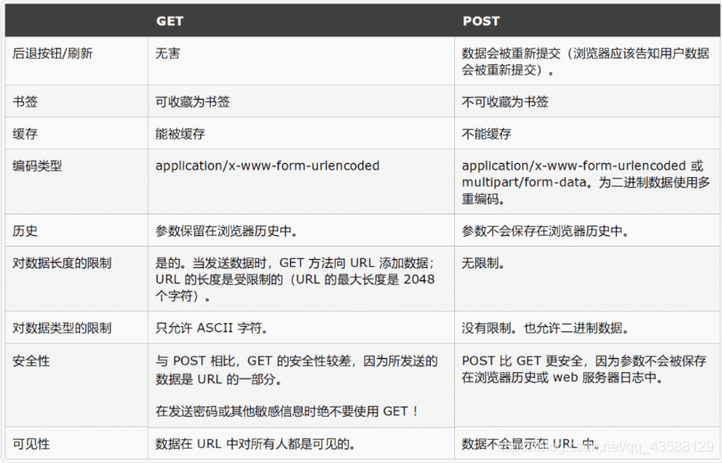
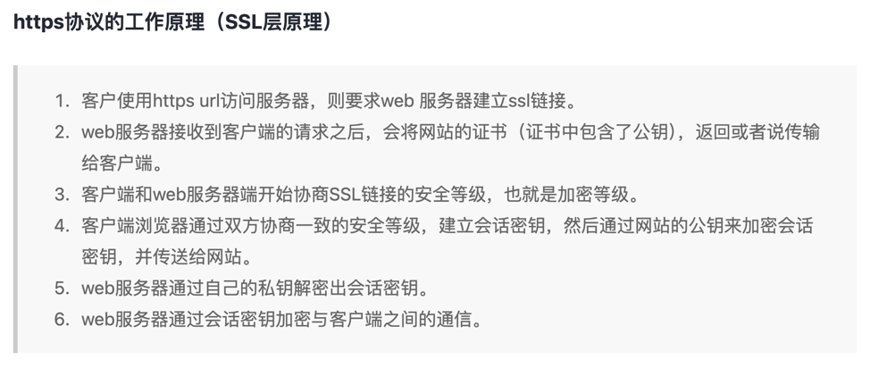
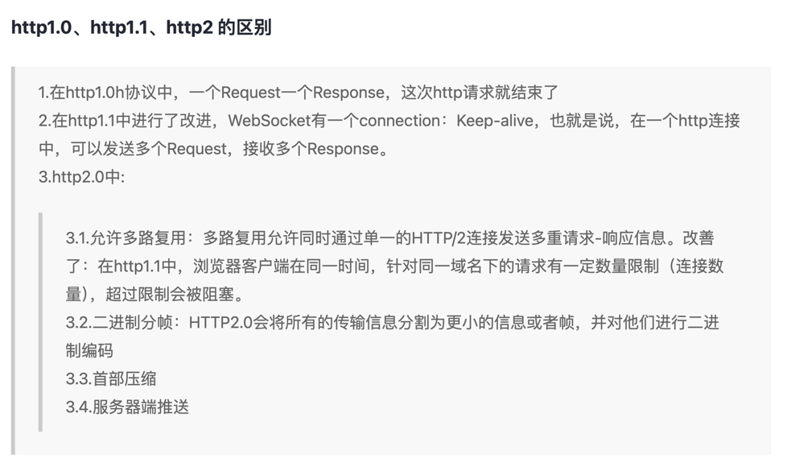
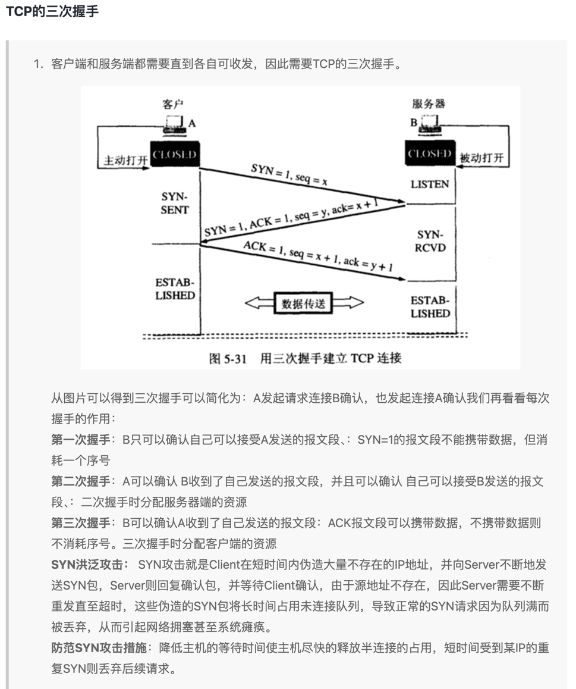
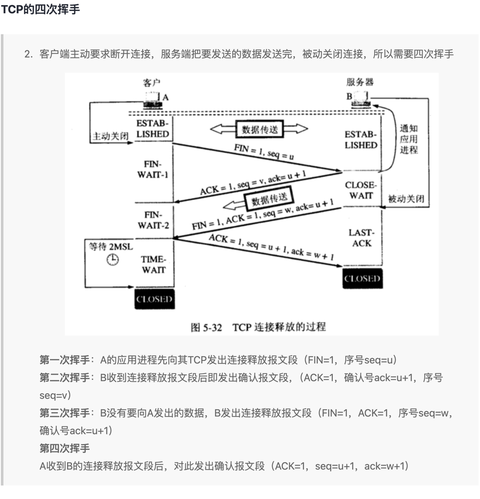
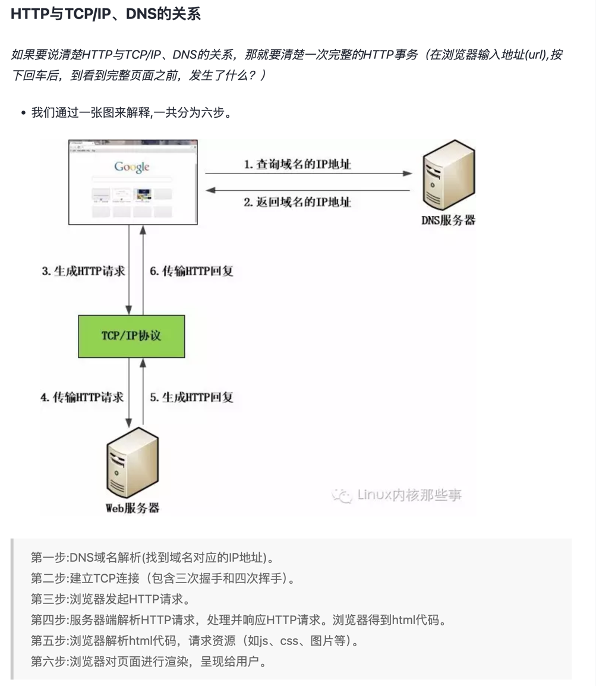
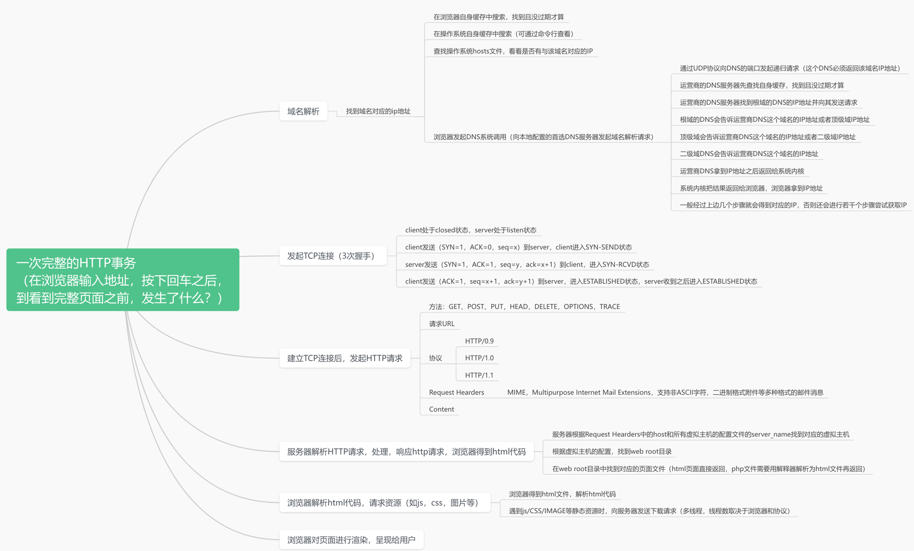
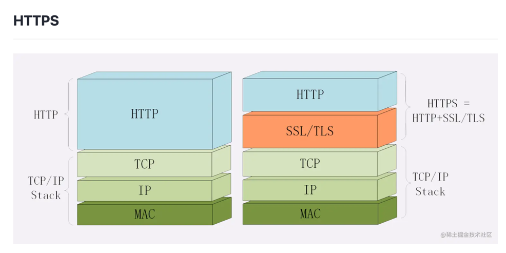

## 9种方式
根据 HTTP 标准，HTTP 请求可以使用多种请求方法。

HTTP1.0 定义了三种请求方法： 
  - GET, POST 和 HEAD 方法。

HTTP1.1 新增了六种请求方法：
  - OPTIONS、PUT、PATCH、DELETE、TRACE 和 CONNECT 方法。

### get

【获取资源】本质就是发送一个请求来取得服务器上的某一资源。
资源通过一组HTTP头和呈现数据（如HTML文本，或者图片或者视频等）返回给客户端。
GET请求中，永远不会包含呈现数据。 即GET请求只用来向服务器获取资源，
而GET请求本身不应该携带任何呈现数据。

1. 登录时GET获取服务器数据库用户名和密码进行验证。
2. 下载文本、图片、音视频等时获取服务器资源。

### post
【传输实体文本】向指定资源提交数据进行处理请求（例如提交表单或者上传文件）。
数据被包含在POST请求体中。POST 请求可能会导致新的资源的建立或已有资源的修改。

1. 提交用户注册信息。
2. 提交修改的用户信息。

### put
【传输文件】从客户端向服务器传送的数据取代指定的文档的内容，即指定上传资源存放路径。
这个方法比较少见。HTML表单也不支持这个。本质上来讲， PUT和POST极为相似，
都是向服务器发送数据，但它们之间有一个重要区别，PUT通常指定了资源的存放位置，
而POST则没有，POST的数据存放位置由服务器自己决定。

如一个用于提交博文的URL，/addBlog。如果用PUT，
则提交的URL会是像这样的”/addBlog/abc123”，其中abc123就是这个博文的地址。
而如果用POST，则这个地址会在提交后由服务器告知客户端。目前大部分博客都是这样的。
显然，PUT和POST用途是不一样的。具体用哪个还取决于当前的业务场景。

### head
【获得报文首部】类似于 GET 请求，只不过返回的响应中没有具体的内容，
用于获取报头。欲判断某个资源是否存在，我们通常使用GET，但这里用HEAD则意义更加明确。

1. 向服务器获取某些易过期或丢失大型文件时，可用HEAD方式查询资源是否存在。

### options
【询问支持的方法】客户端询问服务器可以提交哪些请求方法。这个方法很有趣，
它用于获取当前URL所支持的方法。若请求成功，则它会在HTTP头中包含一个名为“Allow”的头，
值是所支持的方法，如“GET, POST”。

极少使用。

### patch
【局部更新文件】是对 PUT 方法的补充，用来对已知资源进行局部更新 。

极少使用。

### delete
【删除文件】请求服务器删除指定的资源。

基本上这个也很少见，不过还是有一些地方比如amazon的S3云服务里面就用的这个方法来删除资源。

### trace
【追踪路径】回显服务器收到的请求，客户端可以对请求消息的传输路径进行追踪，TRACE方法是让Web服务器端将之前的请求通信还给客户端的方法。主要用于测试或诊断。

极少使用。

### connect
【要求用隧道协议连接代理】HTTP/1.1 协议中预留给能够将连接改为管道方式的代理服务器。CONNECT方法要求在与代理服务器通信时建立隧道，实现用隧道协议进行TCP通信。主要使用SSL（安全套接层）和TLS（传输层安全）协议把通信内容加密后经网络隧道传输。

极少使用。

### get 和 post 区别

GET 请求是一种 HTTP 方法，用于从服务器检索数据。它将请求的数据附加在 URL 后面，
以查询字符串的形式出现。

特点：
- 安全性和隐私性较低，因为请求数据暴露在 URL 中。
- 数据量有限制，通常不超过 2KB。
- 适合请求无状态的操作，如页面跳转、检索数据等。

POST 请求是一种 HTTP 方法，用于向服务器发送数据。它将数据存储在请求体中，不会出现在 URL 中。

特点：
- 安全性和隐私性较高，因为数据不暴露在 URL 中。
- 数据量较大，没有大小限制。
- 适合请求有状态的操作，如表单提交、上传文件等。

## http和https区别

定义:
http: 是一个客户端和服务端请求和应答的标准 用于从www服务器传输超文本到本地浏览器传输协议
https: 是一安全为目标的HTTP通道,即HTTP下加入SSL(Secure Sockets Layer: 安全加密协议层)层进行加密, 作用是:建立一个信息安全通道,确保数据的传输和网站的真实性

SSL 即安全套接层（Secure Sockets Layer）
TLS（传输层安全，Transport Layer Security）

http 和 https 的区别及优缺点？

    http 是超文本传输协议，信息是明文传输，HTTPS 协议要比 http 协议安全，https 是具有安全性的 ssl 加密传输协议，可防止数据在传输过程中被窃取、改变，确保数据的完整性(当然这种安全性并非绝对的，
        对于更深入的 Web 安全问题，此处暂且不表)。
    http 协议的默认端口为 80，https 的默认端口为 443。
    http 的连接很简单，是无状态的。https 握手阶段比较费时，会使页面加载时间延长 50%，增加 10%~20%的耗电。
    https 缓存不如 http 高效，会增加数据开销。
    Https 协议需要 ca(Certificate Authority, 包含公钥和私钥) 证书，费用较高，功能越强大的证书费用越高。
    SSL 证书需要绑定 IP，不能再同一个 IP 上绑定多个域名，IPV4 资源支持不了这种消耗。

客户端在使用 HTTPS 方式与 Web 服务器通信时有以下几个步骤：

    客户端使用 https url 访问服务器，则要求 web 服务器建立 ssl 链接。
    web 服务器接收到客户端的请求之后，会将网站的证书（证书中包含了公钥），传输给客户端。
    客户端和 web 服务器端开始协商 SSL 链接的安全等级，也就是加密等级。
    客户端浏览器通过双方协商一致的安全等级，建立会话密钥，然后通过网站的公钥来加密会话密钥，并传送给网站。
    web 服务器通过自己的私钥解密出会话密钥。
    web 服务器通过会话密钥加密与客户端之间的通信。

HTTP1.1 的缺陷
高延迟 — 队头阻塞(Head-Of-Line Blocking)
无状态特性 — 阻碍交互  (header携带内容过大, 增加传输成本)
明文传输 — 不安全性
不支持服务端推送

HTTP/2
二进制传输
TCP协议的部分特性挪到了应用层, 把原来的"Header+Body"的消息"打散"为数个小片的二进制"帧"(Frame)
HTTP/2 中，同域名下所有通信都在单个连接上完成，该连接可以承载任意数量的双向数据流。每个数据流都以消息的形式发送，而消息又由一个或多个帧组成
header压缩
在客户端和服务器端使用“首部表”来跟踪和存储之前发送的键-值对，对于相同的数据，不再通过每次请求和响应发送；
首部表在HTTP/2的连接存续期内始终存在，由客户端和服务器共同渐进地更新;
每个新的首部键-值对要么被追加到当前表的末尾，要么替换表中之前的值

        请求一发送了所有的头部字段，第二个请求则只需要发送差异数据，这样可以减少冗余数据，降低开销

    多路复用
        同个域名只需要占用一个 TCP 连接, 使用一个连接并行发送多个请求和响应,
        -这样整个页面资源的下载过程只需要一次慢启动，同时也避免了多个TCP连接竞争带宽所带来的问题
        并行交错地发送多个请求/响应，请求/响应之间互不影响
        在HTTP/2中，每个请求都可以带一个31bit的优先值，0表示最高优先级， 数值越大优先级越低

    serve push 也叫  cache push
        如果服务端推送的资源已经被浏览器缓存过，浏览器可以通过发送RST_STREAM帧来拒收(可以在不断开连接的前提下取消某个 request 的 stream，表现更好)

    提高安全性
        “h2"表示加密的HTTP/2，“h2c”表示明文的HTTP/2。

RTT（Round-Trip Time）:
往返时延。表示从发送端发送数据开始，到发送端收到来自接收端的确认（接收端收到数据后便立即发送确认），总共经历的时延

HTTP/2 缺点:
TCP 以及 TCP(Transmission Control Protocol, 传输控制协议)+TLS 建立连接的延时
HTTP/2都是使用TCP协议来传输的，而如果使用HTTPS的话，还需要使用TLS协议进行安全传输，而使用TLS也需要一个握手过程，
这样就需要有两个握手延迟过程:
①在建立TCP连接的时候，需要和服务器进行三次握手来确认连接成功，即需要消耗完 1.5 个 RTT 之后才能进行数据传输。
②进行TLS连接，TLS有两个版本——TLS1.2和TLS1.3，每个版本建立连接所花的时间不同，大致是需要1~2个RTT。
总之，在传输数据之前，我们需要花掉 3～4 个 RTT。

    TCP 的队头阻塞并没有彻底解决
        当出现了丢包时，HTTP/2 的表现反倒不如 HTTP/1 了。
        因为TCP为了保证可靠传输，有个特别的“丢包重传”机制，丢失的包必须要等待重新传输确认，
        HTTP/2出现丢包时，整个 TCP 都要开始等待重传，那么就会阻塞该TCP连接中的所有请求（如下图）。
        而对于 HTTP/1.1 来说，可以开启多个 TCP 连接，出现这种情况反到只会影响其中一个连接，剩余的 TCP 连接还可以正常传输数据

    多路复用导致服务器压力上升
        多路复用没有限制同时请求数。请求的平均数量与往常相同，但实际会有许多请求的短暂爆发，导致瞬时 QPS 暴增

    多路复用容易 Timeout
        大批量的请求同时发送，由于 HTTP2 连接内存在多个并行的流，而网络带宽和服务器资源有限，每个流的资源会被稀释，
        虽然它们开始时间相差更短，但却都可能超时。

TCP三次握手
syn 同步包  服务器 SYN+ack 表示接收到信息  最后客户端 ack 确认
第一次握手：
  建立连接时，客户端发送syn包（syn=j）到服务器，并进入SYN_SENT状态，等待服务器确认；
  SYN：同步序列编号（Synchronize Sequence Numbers）。
第二次握手：
  服务器收到syn包并确认客户的SYN（ack=j+1），同时也发送一个自己的SYN包（syn=k），
  即SYN+ACK包，此时服务器进入SYN_RECV状态；
第三次握手：
  客户端收到服务器的SYN+ACK包，向服务器发送确认包ACK(ack=k+1），
  此包发送完毕，客户端和服务器进入ESTABLISHED（TCP连接成功）状态，完成三次握手。

TCP 四次挥手

    1)客户端进程发出连接释放报文，并且停止发送数据。释放数据报文首部，FIN=1，其序列号为seq=u（等于前面已经传送过来的数据的最后一个字节的序号加1），此时，客户端进入FIN-WAIT-1（终止等待1）状态。 TCP规定，FIN报文段即使不携带数据，也要消耗一个序号。

    2）服务器收到连接释放报文，发出确认报文，ACK=1，ack=u+1，并且带上自己的序列号seq=v，此时，服务端就进入了CLOSE-WAIT（关闭等待）状态。TCP服务器通知高层的应用进程，客户端向服务器的方向就释放了，这时候处于半关闭状态，即客户端已经没有数据要发送了，但是服务器若发送数据，客户端依然要接受。这个状态还要持续一段时间，也就是整个CLOSE-WAIT状态持续的时间。
    3）客户端收到服务器的确认请求后，此时，客户端就进入FIN-WAIT-2（终止等待2）状态，等待服务器发送连接释放报文（在这之前还需要接受服务器发送的最 后的数据）。
    4）服务器将最后的数据发送完毕后，就向客户端发送连接释放报文，FIN=1，ack=u+1，由于在半关闭状态，服务器很可能又发送了一些数据，假定此时的序列号为seq=w，此时，服务器就进入了LAST-ACK（最后确认）状态，等待客户端的确认。
    5）客户端收到服务器的连接释放报文后，必须发出确认，ACK=1，ack=w+1，而自己的序列号是seq=u+1，此时，客户端就进入了TIME-WAIT（时间等待）状态。注意此时TCP连接还没有释放，必须经过2∗∗MSL（最长报文段寿命）的时间后，当客户端撤销相应的TCB后，才进入CLOSED状态。
    6）服务器只要收到了客户端发出的确认，立即进入CLOSED状态。同样，撤销TCB后，就结束了这次的TCP连接。可以看到，服务器结束TCP连接的时间要比客户端早一些。

TCP/IP / 如何保证数据包传输的有序可靠？
对字节流分段并进行编号然后通过 ACK 回复和超时重发这两个机制来保证。
（1）为了保证数据包的可靠传递，发送方必须把已发送的数据包保留在缓冲区；
（2）并为每个已发送的数据包启动一个超时定时器；
（3）如在定时器超时之前收到了对方发来的应答信息（可能是对本包的应答，也可以是对本包后续包的应答），则释放该数据包占用的缓冲区;
（4）否则，重传该数据包，直到收到应答或重传次数超过规定的最大次数为止。
（5）接收方收到数据包后，先进行CRC校验，如果正确则把数据交给上层协议，然后给发送方发送一个累计应答包，表明该数据已收到，如果接收方正好也有数据要发给发送方，应答包也可方在数据包中捎带过去。

## 缓存

1. 强制缓存
强制缓存就是向浏览器缓存查找该请求结果，并根据该结果的缓存规则来决定是否使用该缓存结果的过程。
当浏览器向服务器发起请求时，服务器会将缓存规则放入HTTP响应报文的HTTP头中和请求结果一起返回给浏览器，
控制强制缓存的字段分别是 **Expires** 和 **Cache-Control**，其中**Cache-Control优先级比Expires高**。
强制缓存的情况主要有三种(暂不分析协商缓存过程)，如下：

       1. 不存在该缓存结果和缓存标识，强制缓存失效，则直接向服务器发起请求（跟第一次发起请求一致）。
       2. 存在该缓存结果和缓存标识，但该结果已失效，强制缓存失效，则使用协商缓存。
       3. 存在该缓存结果和缓存标识，且该结果尚未失效，强制缓存生效，直接返回该结果
Cache-Control: no-cache 使用协商缓存  no-store 不缓存

2. 协商缓存
协商缓存就是强制缓存失效后，浏览器携带缓存标识向服务器发起请求，由服务器根据缓存标识决定是否使用缓存的过程，
同样，协商缓存的标识也是在响应报文的HTTP头中和请求结果一起返回给浏览器的，
控制协商缓存的字段分别有：**Last-Modified / If-Modified-Since 和 Etag / If-None-Match**，
其中 **Etag / If-None-Match的优先级比Last-Modified / If-Modified-Since高**。协商缓存主要有以下两种情况：

        1.协商缓存生效，返回304
        2.协商缓存失效，返回200和请求结果结果

缓存决策示例
